# Բովանդակություն {#բովանդակություն .TOC-Heading1 .unnumbered}

[Ներածություն [2](#_Toc228039502)](#_Toc228039502)

[ԳԼՈՒԽ 1. ԳՐԱՖՆԵՐԻ ՏԵՍՈՒԹՅՈՒՆ
[7](#գլուխ-1.-գրաֆների-տեսություն)](#գլուխ-1.-գրաֆների-տեսություն)

[1.1 Գրաֆի Հասկացությունը և Կիրառական Նշանակությունը
[7](#գրաֆի-հասկացությունը-և-կիրառական-նշանակությունը)](#գրաֆի-հասկացությունը-և-կիրառական-նշանակությունը)

[1.2 Գրաֆի սահմանումը, տեսակները և տրման եղանակները
[8](#գրաֆի-սահմանումը-տեսակները-և-տրման-եղանակները)](#գրաֆի-սահմանումը-տեսակները-և-տրման-եղանակները)

[1․3 Աստիճաններ, ենթագրաֆներ և ճանապարհներ
[10](#աստիճաններ-ենթագրաֆներ-և-ճանապարհներ)](#աստիճաններ-ենթագրաֆներ-և-ճանապարհներ)

[1.4 Գործողություններ գրաֆների հետ
[12](#գործողություններ-գրաֆների-հետ)](#գործողություններ-գրաֆների-հետ)

[1․5 Ծառեր, միակցման կետեր և կամուրջներ
[15](#ծառեր-միակցման-կետեր-և-կամուրջներ)](#ծառեր-միակցման-կետեր-և-կամուրջներ)

[ԳԼՈԻԽ 2. ՏՎՅԱԼՆԵՐԻ ԲԱԶԱ ԵՎ ԱԼԳՈՐԻԹՄՆԵՐ
[17](#գլոիխ-2.-տվյալների-բազա-եվ-ալգորիթմներ)](#գլոիխ-2.-տվյալների-բազա-եվ-ալգորիթմներ)

[2․1 Տվյալների Բազայի Ձևաչափը և Ծավալը
[17](#տվյալների-բազայի-ձևաչափը-և-ծավալը)](#տվյալների-բազայի-ձևաչափը-և-ծավալը)

[2․2 Louvain ալգորիթմ [21](#louvain-ալգորիթմ)](#louvain-ալգորիթմ)

[2․3 Adamic-Adar index Ալգորիթմ
[25](#adamic-adar-index-ալգորիթմ)](#adamic-adar-index-ալգորիթմ)

[ԳԼՈՒԽ 3․ ԾՐԱԳՐԱՅԻՆ ՄԱՍ
[29](#գլուխ-3-ծրագրային-մաս)](#գլուխ-3-ծրագրային-մաս)

[3․1 Օգտագործվող գրադարաններ
[29](#օգտագործվող-գրադարաններ)](#օգտագործվող-գրադարաններ)

[3․2 Հիմնական ծրագիր [30](#հիմնական-ծրագիր)](#հիմնական-ծրագիր)

[3․3 Ծրագրային արտածում [31](#ծրագրային-արտածում)](#ծրագրային-արտածում)

[3․3.1 Ուղղորդված գրաֆի արտածում
[31](#ուղղորդված-գրաֆի-արտածում)](#ուղղորդված-գրաֆի-արտածում)

[3.3.2 Ուղղորդված քաշով գրաֆի արտածում
[32](#ուղղորդված-քաշով-գրաֆի-արտածում)](#ուղղորդված-քաշով-գրաֆի-արտածում)

[3.3.3 Ոչ ուղղորդված գրաֆի արտածում
[34](#ոչ-ուղղորդված-գրաֆի-արտածում)](#ոչ-ուղղորդված-գրաֆի-արտածում)

[3.3.4 Ոչ ուղղորդված քաշով գրաֆի արտածում
[36](#ոչ-ուղղորդված-քաշով-գրաֆի-արտածում)](#ոչ-ուղղորդված-քաշով-գրաֆի-արտածում)

[3.3.5 Adamic-Adar ինդեքսի արտածում
[37](#adamic-adar-ինդեքսի-արտածում)](#adamic-adar-ինդեքսի-արտածում)

[Գլուխ 4․ Գրաֆների տեսության միջոցով ձեռնարկության աշխատանքի
անվտանգության կառավարման համակարգի վիճակի գնահատում
[39](#գլուխ-4-գրաֆների-տեսության-միջոցով-ձեռնարկության-աշխատանքի-անվտանգության-կառավարման-համակարգի-վիճակի-գնահատում)](#գլուխ-4-գրաֆների-տեսության-միջոցով-ձեռնարկության-աշխատանքի-անվտանգության-կառավարման-համակարգի-վիճակի-գնահատում)

[ԳԼՈՒԽ 5 Գրաֆերի տեսության օգնությամբ սոցիալական ցանցերի մոդելավորման և
վերլուծման աշխատանքների ինքնարժեքի և գնի հաշվարկը
[45](#գլուխ-5-գրաֆերի-տեսության-օգնությամբ-սոցիալական-ցանցերի-մոդելավորման-և-վերլուծման-աշխատանքների-ինքնարժեքի-և-գնի-հաշվարկը)](#գլուխ-5-գրաֆերի-տեսության-օգնությամբ-սոցիալական-ցանցերի-մոդելավորման-և-վերլուծման-աշխատանքների-ինքնարժեքի-և-գնի-հաշվարկը)

[5․1 Համալրող առարկաների ծախսի հաշվարկ
[46](#համալրող-առարկաների-ծախսի-հաշվարկ)](#համալրող-առարկաների-ծախսի-հաշվարկ)

[5.2 Էլեկտրաէներգիայի ծախսի հաշվարկ
[47](#էլեկտրաէներգիայի-ծախսի-հաշվարկ)](#էլեկտրաէներգիայի-ծախսի-հաշվարկ)

[5.3 Աշխատողների հիմնական աշխատավարձի հաշվարկը
[47](#աշխատողների-հիմնական-աշխատավարձի-հաշվարկը)](#աշխատողների-հիմնական-աշխատավարձի-հաշվարկը)

[5.4 Աշխատողների լրացուցիչ աշխատավարձի հաշվարկը
[48](#աշխատողների-լրացուցիչ-աշխատավարձի-հաշվարկը)](#աշխատողների-լրացուցիչ-աշխատավարձի-հաշվարկը)

[5.5 Սարքավորումների պահպանման և շահագործման ծախսերի հաշվարկը
[49](#սարքավորումների-պահպանման-և-շահագործման-ծախսերի-հաշվարկը)](#սարքավորումների-պահպանման-և-շահագործման-ծախսերի-հաշվարկը)

[5.6 Տարածքի վարձակալության ծախսի հաշվարկը
[51](#տարածքի-վարձակալության-ծախսի-հաշվարկը)](#տարածքի-վարձակալության-ծախսի-հաշվարկը)

[5.7 Ընդհանուր տնտեսական ծախսերի հաշվարկը
[51](#ընդհանուր-տնտեսական-ծախսերի-հաշվարկը)](#ընդհանուր-տնտեսական-ծախսերի-հաշվարկը)

[5.8 Համակարգի/փաթեթի ինքնարժքի կալկուլացիան
[51](#համակարգիփաթեթի-ինքնարժքի-կալկուլացիան)](#համակարգիփաթեթի-ինքնարժքի-կալկուլացիան)

[5.9. Շահույթի և միավորի գնի հաշվարկը
[52](#շահույթի-և-միավորի-գնի-հաշվարկը)](#շահույթի-և-միավորի-գնի-հաշվարկը)

[Գլուխ 6 Գեոինֆորմացիոն համակարգերի մոդելավորման մեջ գրաֆների տեսության
կիրառումը
[54](#գլուխ-6-գեոինֆորմացիոն-համակարգերի-մոդելավորման-մեջ-գրաֆների-տեսության-կիրառումը)](#գլուխ-6-գեոինֆորմացիոն-համակարգերի-մոդելավորման-մեջ-գրաֆների-տեսության-կիրառումը)

[Եզրակացություն [58](#եզրակացություն)](#եզրակացություն)

[]{#_Toc228039502 .anchor}

# Ներածություն {#ներածություն .unnumbered}

Ժամանակակից տեղեկատվական հասարակության մեջ սոցիալական ցանցերը դարձել են
մարդկային փոխգործակցության ամենաբնորոշ ձևերից մեկը։ Դրանք ոչ միայն
հաղորդակցման հարթակներ են, այլ նաև բարդ, դինամիկ համակարգեր, որոնցում
ամեն օր ձևավորվում, ամրապնդվում կամ խզվում են հազարավոր
հարաբերություններ։ Այս համակարգերի ուսումնասիրությունը, կառուցվածքի
բացահայտումը և օրինաչափությունների հայտնաբերումը դարձել են ժամանակակից
համակարգչային գիտության, սոցիոլոգիայի ու կիրառական մաթեմատիկայի
ամենաակտուալ խնդիրներից մեկը։

Ցանկացած սոցիալական ցանց, անկախ իր բնույթից ու մասշտաբից, կարելի է
դիտարկել որպես հարաբերությունների մի ամբողջություն, որտեղ անհատները
կապված են միմյանց հետ ուղղակի կամ անուղղակի կերպով։ Այս բնորոշ
կառուցվածքն ունի իր բնական մաթեմատիկական համարժեքը՝ գրաֆը, որն ի վիճակի
է ճշգրիտ և ֆորմալ ձևով արտահայտել ինչպես ցանցի բաղկացուցիչ անձանց,
այնպես էլ նրանց միջև գոյություն ունեցող բոլոր հարաբերությունները։ Հենց
այս ֆորմալ ներկայացման հնարավորությունն է, որ դարձնում է գրաֆերի
տեսությունը սոցիալական ցանցերի վերլուծության ամենահզոր և ամենատարածված
գործիքներից մեկը։

Գրաֆերի տեսությունն իբրև մաթեմատիկայի ճյուղ ծնունդ է առել դեռ
տասնութերորդ դարում՝ Լեոնարդ Էյլերի հայտնի Քյոնիգսբերգի կամուրջների
խնդրի շուրջ ծավալված հետազոտությունների արդյունքում, սակայն իր ամենամեծ
կիրառական արժեքն ձեռք է բերել հատկապես քսաներորդ և քսանմեկերորդ
դարերում՝ համակարգչային ցանցերի, կենսաինֆորմատիկայի, լոգիստիկայի և
սոցիոլոգիական ուսումնասիրությունների ոլորտներում։ Գրաֆի հիմնական
հասկացությունները՝ գագաթ, կող, ճանապարհ, ցիկլ, կապակցվածություն,
ձևավորում են այն հիմնարար տերմինաբանական ու հայեցակարգային հիմքը, որի
վրա կառուցվում են ցանցային վերլուծության բոլոր ժամանակակից մոտեցումները։

Սույն դիպլոմային աշխատանքի շրջանակներում ուսումնասիրվում է սոցիալական
ցանցի գրաֆային մոդելավորման և վերլուծության խնդիրը։ Աշխատանքի հիմնական
նպատակն է ֆորմալ մաթեմատիկական ապարատի կիրառմամբ ուսումնասիրել
սոցիալական ցանցի կառուցվածքը, բացահայտել դրանում ձևավորված բնական
խմբավորումները, ինչպես նաև մշակել մոտեցում, որն ի վիճակի կլինի
կանխատեսել ցանցում հնարավոր նոր կապերի ձևավորումը։

Հետազոտության գիտական արդիականությունը պայմանավորված է մի քանի
հանգամանքով։ Նախ, թվային հարթակների արագ զարգացման ու տարածման
արդյունքում ձևավորվել են հսկայածավալ ցանցային կառուցվածքներ, որոնց
ուսումնասիրությունն ու կառավարումն առանց մաթեմատիկական ֆորմալ
մոտեցումների ուղղակի անհնար է։ Երկրորդ, ցանցային վերլուծությունն ունի
ակնհայտ կիրառական արժեք. սոցիալական կապերի ձևաչափի ըմբռնումն օգնում է ոչ
միայն ավելի արդյունավետ կապ հաստատել մարդկանց միջև, այլ նաև կիրառվում է
տեղեկատվության տարածման, ազդեցության ուղիների, ինչպես նաև ցանցային
անվտանգության ոլորտներում։ Երրորդ, ցանցի ներսում ձևավորված խմբային
կառուցվածքների ուսումնասիրությունը բացահայտում է ոչ ակնհայտ, թաքնված
կապեր ու օրինաչափություններ, որոնք ուղղակի դիտարկմամբ հնարավոր չէ
նկատել։

Աշխատանքի ընթացքում կիրառվել են գրաֆերի տեսության բազմաթիվ հիմնարար
գործիքներ ու ալգորիթմներ։ Մասնավորապես, սոցիալական ցանցի կառուցվածքը
ֆորմալ կերպով ներկայացվում է հարևանության մատրիցի միջոցով, ինչը հնարավոր
է դարձնում կապերի արդյունավետ գրանցումն ու հետագա մշակումը։ Ցանցի
ենթախմբային կառուցվածքն ուսումնասիրվում է մոդուլյարության հայեցակարգի
հիման վրա՝ ձգտելով ցանցն օպտիմալ կերպով բաժանել այնպիսի խմբերի, որոնց
ներքին կապերն ակնհայտ կերպով ավելի խիտ են, քան արտաքին կապերը։ Կապերի
կանխատեսման խնդրի լուծման համար կիրառվում է ընդհանուր հարևանների
հայեցակարգի վրա հիմնված մաթեմատիկական մոտեցում, ըստ որի երկու անկապ
հանգույցների միջև ապագա կապ ստեղծելու հավանականությունն ուղղակիորեն
կախված է ոչ միայն նրանց ընդհանուր ծանոթների քանակից, այլ նաև այդ
ծանոթների եզակիությունից ու հազվադեպությունից ցանցի ընդհանուր մասշտաբով։

Ուսումնասիրության գիտական նորույթն արտահայտվում է նրանում, որ ի
տարբերություն այն մոտեցումների, որոնք սոցիալական ցանցի վերլուծությունն
իրականացնում են զուտ վիճակագրական մեթոդներով, սույն աշխատանքում
կիրառվում է ֆորմալ մաթեմատիկական ապարատ՝ ամրագրելով ոչ միայն թե ինչ է
կատարվում ցանցում, այլ նաև թե ինչու և ինչ օրինաչափություններով։

ԽՆԴՐԻ ՆԿԱՐԱԳՐՈՒԹՅՈՒՆ

**Խմդրի նպատակը\
**Դիտարկել սոցիալական ցանցը գրաֆի տեսքով։ Օգտագործել գրաֆերի տեսության
սկզբնական սահմանումները, ինչպես նաև սահմանումների վրա հիմնված
ալգորիթմները՝ օգտատերերի հետ կապ ստեղծելու, համայնքների բաժանելու և նոր
կապեր առաջարկելու նպատակով։

**Խնդրի մոդելավորում**

Ծանոթանալ սոցիալական ցանցերի կառուցվածքի հետ։

Ստեղծել սոցիալական ցանցի կառուցվածքին համապատասխանող տվյալների բազա՝
հետագա փորձարկումների նպատակով։

Գրաֆերի տեսությամբ մշակել տվյալները, ստեղծել կապեր, համայնքներ և գտնել
ընդհանուր գագաթներ։

Ծանոթանալ Louvain ալգորիթմին, տվյալների հիման վրա ցանցը բաժանել
երևակայական համայնքների։

Ուսումնասիրել Adamic-Adar Index ալգորիթմի աշխատանքը, նրա օգնությամբ
իրարից անկախ գագաթների միջև ստեղծել կապ։

Մշակված տվյալները արտածել թե՛ թվային և թե՛ պատկերների միջոցով՝ ստացված
արդյունքը հասկանալի դարձնելու նպատակով։

# ԳԼՈՒԽ 1. ԳՐԱՖՆԵՐԻ ՏԵՍՈՒԹՅՈՒՆ {#գլուխ-1.-գրաֆների-տեսություն .unnumbered}

## **Գրաֆի Հասկացությունը և Կիրառական Նշանակությունը** {#գրաֆի-հասկացությունը-և-կիրառական-նշանակությունը .DIplom-etnaglux}

##  {#section .DIplom-etnaglux .unnumbered}

Մարդկային մտածողությունը հազարամյակներ շարունակ ձգտել է բարդ երևույթներն
արտահայտել պարզ, ընդհանրացված մոդելների միջոցով։ Ֆիզիկան նկարագրում է
շարժումը բանաձևերով, երկրաչափությունն ուսումնասիրում է տարածությունը,
իսկ երբ խոսքը վերաբերում է հարաբերություններին, կապերին ու
կառուցվածքներին, մաթեմատիկան առաջարկում է իր ամենաբնական ու
ամենաարտահայտիչ գործիքը՝ գրաֆը։

Գրաֆն իր էությամբ ոչ այլ ինչ է, քան կապերի մոդել։ Պատկերացնենք մի
իրավիճակ, երբ կան մի շարք օբյեկտներ, և դրանցից որոշները կապված են
միմյանց հետ ինչ-որ հարաբերությամբ։ Կարևոր չէ, թե այդ օբյեկտներն ինչ են.
քաղաքներ, որոնք կապված են ճանապարհներով, մարդիկ, որոնք ճանաչում են
միմյանց, համակարգիչներ, որոնք փոխանցում են տեղեկատվություն, կամ կայքեր,
որոնք հղում են կատարում մեկը մյուսի վրա։ Յուրաքանչյուր այս դեպքում կա
օբյեկտ և կապ, և հենց այս երկու բաղադրիչն է կազմում գրաֆի հիմքը։
Օբյեկտներն անվանվում են գագաթներ, կապերն՝ կողեր, իսկ դրանց
ամբողջությունը միասին կազմում է գրաֆը։

Պատմականորեն գրաֆի գաղափարն առաջին անգամ ի հայտ եկավ 1736 թվականին, երբ
շվեյցարացի մաթեմատիկոս Լեոնարդ Էյլերն իր ուշադրությունը կենտրոնացրեց
Պրուսիայի Քյոնիգսբերգ քաղաքի բնակիչների կողմից բարձրացված մի թվացյալ
պարզ հարցի վրա, հնարավո՞ր է արդյոք քաղաքի եղած յոթ կամուրջներից
յուրաքանչյուրով անցնել ճիշտ մեկ անգամ և վերադառնալ ելակետ։ Էյլերն այս
խնդիրը լուծելու համար անտեսեց բոլոր ավելորդ տվյալները՝ չափերը,
հեռավությունները, տեսքն ու ձևը բոլորն անտեսվեցին, մնացին միայն ցամաքի
հատվածները՝ որպես կետեր, և կամուրջները՝ որպես այդ կետերի միջև կապ։
Ստացված ձևավորումն էր, ըստ էության, առաջին գրաֆը մաթեմատիկայի պատմության
մեջ, իսկ Էյլերի ձևակերպած հետևությունն այն մասին, որ նման անցումն անհնար
է, դարձավ գրաֆերի տեսության ծնունդը։

Այդ պահից ի վեր գրաֆերի տեսությունն անընդհատ ու արագ զարգացել է, ընդ
որում ամեն մի դարաշրջան բերել է իր կիրառական ոլորտները։ Տասնիններորդ
դարում գրաֆերը կիրառվեցին քիմիայում՝ մոլեկուլային կառուցվածքների
նկարագրման համար, երկրաչափությունում ու ֆիզիկայում։ Քսաներորդ դարի
կեսերին, երբ ձևավորվեց ժամանակակից համակարգչային գիտությունը, գրաֆերի
տեսությունն արագ դարձավ դրա անբաժան մասը. ծրագրային ալգորիթմների
մշակումից մինչև ցանցային երթուղավորում, տվյալների կառուցվածքներից մինչև
արհեստական ինտելեկտ, ամենուր գրաֆն ապացուցեց իր անփոխարինելի դերը։

Գրաֆի հասկացության ուժն ու գեղեցկությունն կայանում են ունիվերսալության
մեջ։ Նույն մաթեմատիկական ձևավորումը, նույն սահմանումներն ու թեորեմները,
նույն ալգորիթմներն ի վիճակի են նկարագրել ու վերլուծել ինչպես ամբողջ
մոլորակի կապերը, այնպես էլ մի փոքր դասարանի ընկերային կապերը։ Սա այն
հատկանիշն է, որը գրաֆերի տեսությունը դարձրել է ժամանակակից գիտության
ամենաարդյունավետ ու ամենատարածված գործիքներից մեկը։

## 1.2 Գրաֆի սահմանումը, տեսակները և տրման եղանակները {#գրաֆի-սահմանումը-տեսակները-և-տրման-եղանակները .DIplom-etnaglux .unnumbered}

**Սահմանում 1։** (V, E) կարգավոր զույգին կանվանենք գրաֆ, և այն
կնշանակենք G-ով:

G = (V, E) գրաֆի V բազմության տարրերին կանվանենք գրաֆի գագաթներ, իսկ E
բազմության տարրերին՝ կողեր: Եթե անհրաժեշտ է շեշտել, որ V-ն հանդիսանում է
G գրաֆի գագաթների բազմություն (E-ն հանդիսանում է G գրաֆի կողերի
բազմություն), ապա այդ դեպքում մենք կգրենք V(G) (E(G)): Եթե e ∈ E կողը u,
v ∈ V գագաթներից բաղկացած զույգն է, ապա այդ փաստը կգրենք e = uv**-**ով:

Դիցուք G = (V, E) և G′ = (V′, E′) երկու գրաֆներ են:

**Սահմանում 2:** G և G′ գրաֆները կանվանենք հավասար և կգրենք G = G′ այն և
միայն այն դեպքում, երբ V = V′ և E = E′:

Դիցուք G = (V, E)-ն գրաֆ է, u, v ∈ V և e, e′ ∈ E:

**Սահմանում 3:** u և v գագաթները կանվանենք հարևան, եթե uv ∈ E:

**Սահմանում 4:** u գագաթին և e կողին կանվանենք կից, եթե u ∈ e:

**Սահմանում 5:** e և e′ տարբեր կողերը կանվանենք հարևան, եթե գոյություն
ունի v∈V այնպես, որ v-ն կից է e**-**ին և e′-ին:

Եթե G = (V, E) գրաֆում V = {v~1~,..., v~n~} և E = {e~1~,... , e~m~}, ապա
այդ գրաֆին համապատասխանեցնենք n × n կարգի A(G) = (a~ij~)n×n մատրիցը
հետևյալ կերպ.

$$aᵢⱼ = \left\{ \begin{array}{r}
1\ \mathbf{եթե}\mathbf{\ }vᵢ\ \mathbf{և}\mathbf{\ }vⱼ\ \mathbf{հարևան}\mathbf{\ }\mathbf{են},\  \\
0\ \ \ \ \ \ \ \ \ \ \mathbf{հակառակ}\mathbf{\ }\mathbf{դեպքում}
\end{array} \right.\ $$

<figure>
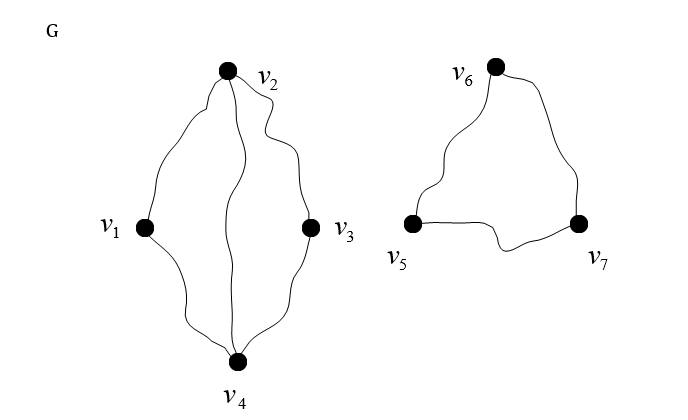
<figcaption>
Նկար 1
</figcaption>
</figure>

A(G) մատրիցը կանվանենք G գրաֆի հարևանության մատրից: Նկատենք, որ ցանկացած
i**-**ի համար (1 ≤ i ≤ n) a~ii~ = 0, և ցանկացած i, j**-**ի համար (1 ≤ i,
j ≤ n) a~ij~ = a~ji~: Նկար 1-ում բերված G գրաֆի հարևանության մատրիցը
կլինի

A(G) = $\begin{matrix}
0 & 1 & 0 & 1 & 0 & 0 & 0 \\
1 & 0 & 1 & 1 & 0 & 0 & 0 \\
0 & 1 & 0 & 1 & 0 & 0 & 0 \\
1 & 1 & 1 & 0 & 0 & 0 & 0 \\
0 & 0 & 0 & 0 & 0 & 1 & 1 \\
0 & 0 & 0 & 0 & 1 & 0 & 1 \\
0 & 0 & 0 & 0 & 1 & 1 & 0
\end{matrix}$

Գրաֆների ևս մի ներկայացումը, որը մենք կդիտարկենք, դա գրաֆի գագաթների
հարևանության ցուցակների միջոցով ներկայացումն է: Եթե G գրաֆում V(G) =
{v~1~,..., v~n~}, ապա դիտարկենք n երկարությամբ զանգված, որի i**-**րդ
բաղադրիչն իրենից ներկայացնում է v~i~ գագաթին հարևան գագաթների ցուցակը
գրված ինչ-որ մի կարգով: Օրինակ, նկար 1-ում պատկերված գրաֆի գագաթների
հարևանության ցուցակներով ներկայացումը կլինի.

<figure>
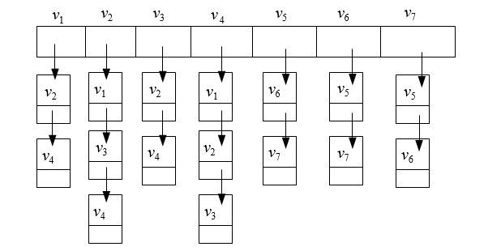
<figcaption>
Նկար 2
</figcaption>
</figure>

## 1․3 Աստիճաններ, ենթագրաֆներ և ճանապարհներ {#աստիճաններ-ենթագրաֆներ-և-ճանապարհներ .DIplom-etnaglux .unnumbered}

**Սահմանում 6:** G գրաֆում v գագաթի աստիճան, որը կնշանակենք
d~G~(v)**-**ով կամ d(v)**-**ով, կանվանենք այդ գագաթին կից կողերի քանակը:

Օրինակ, նկար 1-ում պատկերված G գրաֆում v~2~ գագաթի աստիճանը հավասար է
երեքի:

G գրաֆում v գագաթը կանվանենք մեկուսացված, եթե $d_{G}(v)\  = \ 0$ և
կանվանենք կախված, եթե d~G~(v) = 1:

G գրաֆի համար սահմանենք $\delta(G)$ և $\mathrm{\Delta}(G)$ թվերը հետևյալ
կերպ.

$$\delta(G) = \min_{v \in V}d_{G}(V),\ \ \mathrm{\Delta}(G) = \max_{v \in V}d_{G}(V)$$

$\delta(G)$-ն կանվանենք G գրաֆի նվազագույն աստիճան, իսկ
$\mathrm{\Delta}(G)$-ն՝ առավելագույն աստիճան:

Նկատենք, որ ցանկացած G գրաֆում տեղի ունեն հետևյալ անհավասարությունները.

$$0\  \leq \ \delta(G)\  \leq \ \mathrm{\Delta}(G)\  \leq \ |V(G)|\  - \ 1\mathbf{:}$$

**Թեորեմ 1 (Լ. Էյլեր):** Կամայական G = (V, E) գրաֆում տեղի ունի

$$\sum_{v \in V(G)}^{}{d(v)} = \ 2|E(G)|$$

հավասարությունը:

**Ապացույց:** Իրոք, քանի որ ցանկացած կող կից է երկու գագաթի, ապա
∑~v∈V(G)~ d~G~(v) գումարում այդ կողը հաշվվում է երկու անգամ, հետևաբար՝

∑~v∈V(G)~ d~G~(v) = 2\|E(G)\|

Դիցուք G-ն և H-ը գրաֆներ են:

**Սահմանում 7:** H գրաֆը կոչվում է G գրաֆի ենթագրաֆ և կգրենք H ⊆ G, եթե
V(H) ⊆ V(G) և E(H) ⊆ E(G): Հակառակ դեպքում, կգրենք H ⊈ G:

<figure>
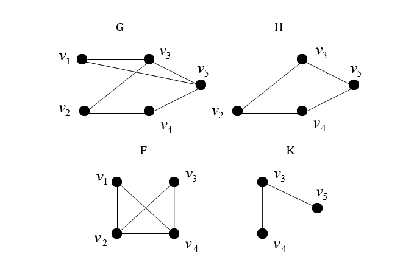
<figcaption>
Նկար 3
</figcaption>
</figure>

**Սահմանում 8:** G գրաֆի $(u_{0},u_{k}) -$շրջանցումը կանվանենք u~0~-ից
u~k~ ճանապարհ կամ $(u_{0},u_{k}) -$-ճանապարհ, եթե $u_{0}u_{1}$-ը,...,
$u_{k - 1}u_{k}$-ն G գրաֆի զույգ առ զույգ տարբեր կողեր են: Եթե P**-**ն G
գրաֆի ճանապարհ է, ապա \|P\|-ով կնշանակենք այդ ճանապարհի երկարությունը,
այսինքն\` այդ ճանապարհի մեջ առկա կողերի քանակը:

Նկատենք, որ նկար 3-ի G գրաֆի
$v_{1},\ v_{3},\ v_{2},\ v_{4},\ v_{3},v_{5}$ շրջանցումը ճանապարհ է, իսկ
$v_{1},\ v_{3},{\ v}_{2},\ v_{4},\ v_{3},\ v_{2},\ v_{4},\ v_{3},v_{5}$-ը\`
ոչ:

**Սահմանում 9:** G գրաֆի $(u_{0},u_{k})$ - ճանապարհը կանվանենք պարզ
$(u_{0},u_{k})$ -ճանապարհ, եթե նրա մեջ մտնող բոլոր գագաթները զույգ առ
զույգ տարբեր են:

**Սահմանում 10:** G գրաֆի $(u_{0},u_{k})$ - ճանապարհը կանվանենք փակ
ճանապարհ կամ ցիկլ, եթե այն փակ շրջանցում է, այսինքն՝ եթե $u_{0}$ =
$u_{k}$:

**Սահմանում 11:** G գրաֆը կանվանենք կապակցված, եթե նրա ցանկացած երկու u
և v գագաթների համար G գրաֆում գոյություն ունի (u, v)-ճանապարհ:

Նկատենք, որ նկար 3-ի G գրաֆի
$v_{1},\ v_{3},\ v_{2},\ v_{4},\ v_{3},v_{5}$ ճանապարհը պարզ
$(v_{1},\ v_{5})$-ճանապարհ չէ, իսկ $v_{1},\ v_{3},\ v_{4},\ v_{5}$**-**ը
նույն գրաֆի պարզ $(v_{1},\ v_{5})$-ճանապարհ է:

**Սահմանում 12:** G գրաֆի ցիկլը կանվանենք պարզ, եթե նրանում կրկնվում են
միայն առաջին և վերջին գագաթները:

Նկատենք, որ նկար 3-ի G գրաֆի
$v_{3},\ v_{2},\ v_{1},\ v_{3},\ v_{5},\ v_{4},{\ v}_{3}$ ճանապարհը պարզ
ցիկլ չէ, իսկ $v_{1},\ v_{3},\ v_{4},\ v_{2},\ v_{1}$-ը նույն գրաֆի պարզ
ցիկլ է:

**Սահմանում 13:** G գրաֆում u և v գագաթների միջև հեռավորությունը

կսահմանենք որպես կարճագույն (u, v)-ճանապարհի երկարություն, եթե G գրաֆում
գոյություն ունի առնվազն մեկ (u, v)-ճանապարհ, և +∞\` հակառակ դեպքում: G
գրաֆում u և v գագաթների միջև հեռավորությունը կնշանակենք
$d_{G}(u,\ v) -$ով կամ d$(u,\ v)$-ով:

Նկատենք, որ

1.  G գրաֆի ցանկացած u և v գագաթների համար $d_{G}(u,\ v)$ ≥ 0, և
    $d_{G}(u,\ v)$ = 0 այն և միայն այն դեպքում, երբ u = v;

2.  G գրաֆի ցանկացած u և v գագաթների համար $d_{G}(u,\ v)$ =
    $d_{G}(v,\ u)$;

3.  G գրաֆի ցանկացած u, v և w գագաթների համար $d_{G}(u,\ v)$ ≤
    $d_{G}(u,\ w)$ + $d_{G}(w,\ v)$:

## 1.4 Գործողություններ գրաֆների հետ {#գործողություններ-գրաֆների-հետ .DIplom-etnaglux .unnumbered}

Այս պարագրաֆում մենք կդիտարկենք տարբեր գործողություններ գրաֆների հետ:
Այդ գործողությունները հնարավորություն են տալիս արդեն գոյություն ունեցող
գրաֆների հիման վրա կառուցել նոր գրաֆներ և նաև օգնում են ներկայացնել
գրաֆի կառուցվածքը ավելի փոքր և պարզ կառուցվածք ունեցող գրաֆների միջոցով:

1.  **Գագաթի հեռացում:** Դիցուք տրված են G գրաֆը (\|V(G)\| ≥ 2) և v ∈
    V(G): G գրաֆից v գագաթի հեռացումը\` G − v գրաֆը սահմանենք հետևյալ
    կերպ. V(G − v) = V(G)\\{v} և E(G − v) = E(G)\\{e ∶ e − ն կից է v −
    ին} :

<figure>
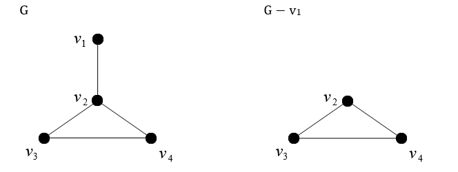
<figcaption>
Նկար 4
</figcaption>
</figure>

Նկար 4-ում պատկերված է G գրաֆը և այդ գրաֆից v~1~ գագաթի հեռացումից
առաջացած G − v~1~ գրաֆը:

2.  **Գագաթի ավելացում:** Դիցուք տրված են G գրաֆը և v ∉ V(G)**:** G
    գրաֆին v գագաթի ավելացումը\` G + v գրաֆը սահմանենք հետևյալ կերպ.
    V(G + v) = V(G) ∪ {v} և E(G + v) = E(G):

<figure>
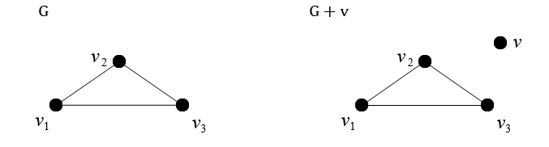
<figcaption>
Նկար 5
</figcaption>
</figure>

Նկում 5-ում պատկերված է G գրաֆը և այդ գրաֆին v գագաթի ավելացումից
առաջացած G + v գրաֆը:

3.  **Կողի հեռացում:** Դիցուք տրված են G գրաֆը և e ∈ E(G): G գրաֆից e
    կողի հեռացումը\`

G − e գրաֆը սահմանենք հետևյալ կերպ. V(G − e) = V(G) և E(G − e) =
E(G)\\{e} :

<figure>
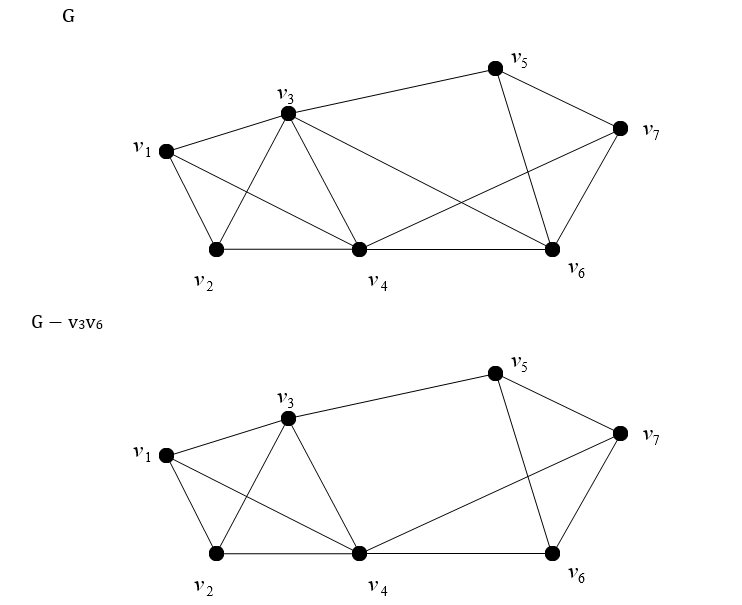
<figcaption>
Նկար 6
</figcaption>
</figure>

Նկար 6-ում պատկերված է G գրաֆը և այդ գրաֆից v~3~v~6~ կողի հեռացումից
առաջացած G − v~3~v~6~ գրաֆը:

4.  **Կողի ավելացում:** Դիցուք տրված են G գրաֆը և e = uv ∉ E(G) (u, v ∈
    V(G)): G գրաֆին e կողի ավելացումը\` G + e գրաֆը սահմանենք հետևյալ
    կերպ. V(G + e) = V(G) և E(G + e) = E(G) ∪ {e}:

<figure>
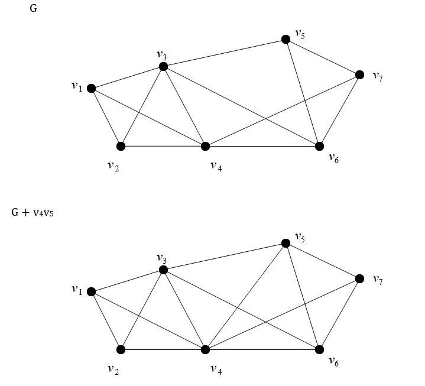
<figcaption>
Նկար 7
</figcaption>
</figure>

Նկար 7-ում պատկերված է G գրաֆը և այդ գրաֆին v~4~v~5~ կողի ավելացումից
առաջացած G + v~4~v~5~ գրաֆը:

## 1․5 **Ծառեր, միակցման կետեր և կամուրջներ** {#ծառեր-միակցման-կետեր-և-կամուրջներ .DIplom-etnaglux .unnumbered}

**Սահմանում 14:** Ցիկլ չպարունակող կապակցված գրաֆը կանվանենք *ծառ*:

**Սահմանում 15:** Ցիկլ չպարունակող գրաֆը կանվանենք *անտառ*:

Նկատենք, որ անտառն այնպիսի գրաֆ է, որի կապակցվածության բոլոր
բաղադրիչներն իրենցից ներկայացնում են ծառեր:

Դիցուք G = (V, E)**-**ն գրաֆ է: c(G)-ով նշանակենք G գրաֆի կապակցված
բաղադրիչների քանակը:

**Սահմանում 16:** G գրաֆի v գագաթը կոչվում է *միակցման կետ*, եթե c(G −
v) \>

c(G)**:**

Նկատենք, որ եթե v**-**ն G կապակցված գրաֆի միակցման կետ է, ապա G -- v
գրաֆը կապակցված չէ:

**Սահմանում 17:** G գրաֆի e կողը կոչվում է *կամուրջ*, եթե c(G − e) \>
c(G)**:**

Նկատենք, որ եթե e**-**ն G կապակցված գրաֆի կամուրջ է, ապա G − e գրաֆը
կապակցված չէ:

<figure>
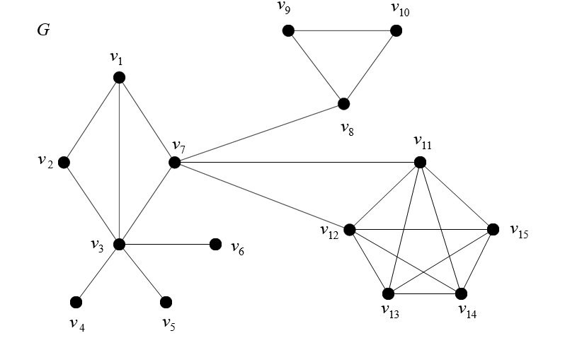
<figcaption>
Նկար 8
</figcaption>
</figure>

Դիտարկենք նկար 8-ում պատկերված G գրաֆը: Հեշտ է տեսնել, որ v~3~, v~7~,
v~8~ գագաթները հանդիսանում են G գրաֆի միակցման կետեր, իսկ v~3~v~4~,
v~3~v~5~, v~3~v~6~, v~7~v~8~ կողերը\` կամուրջներ:

# ԳԼՈԻԽ 2. ՏՎՅԱԼՆԵՐԻ ԲԱԶԱ ԵՎ ԱԼԳՈՐԻԹՄՆԵՐ {#գլոիխ-2.-տվյալների-բազա-եվ-ալգորիթմներ .unnumbered}

Ժամանակակից թվային աշխարհում սոցիալական ցանցերը դարձել են մարդկային
փոխհարաբերությունների ամենաակնառու արտացոլումներից մեկը։ Ամեն օր
միլիոնավոր մարդիկ փոխազդում են միմյանց հետ տարբեր հարթակների միջոցով՝
ձևավորելով բարդ, բազմաշերտ կառուցվածքներ, որոնք դժվար է ուսումնասիրել
առանց մաթեմատիկական և ծրագրային գործիքների։ Հենց այս կարիքն է, որ ծնում
է գրաֆների տեսության և ցանցային վերլուծության կիրառությունը տվյալ
ոլորտում։

## 2․1 Տվյալների Բազայի Ձևաչափը և Ծավալը {#տվյալների-բազայի-ձևաչափը-և-ծավալը .DIplom-etnaglux .unnumbered}

Ուսումնասիրության հիմքում ընկած է .csv ձևաչափով կառուցված տվյալների
բազա, որը պարունակում է 100 պատահականորեն գեներացված օգտատեր։ CSV
ձևաչափն ընտրված է գիտակցաբար, այն ապահովում է տվյալների
ընթեռնելիությունն ու մատչելիությունը, ինչպես նաև ծրագրային մշակման
հեշտությունը տվյալների մշակման գործիքի միջոցով։ 100 օգտատիրոջ ծավալն
ընտրված է երկու գործոնի հավասարակշռությամբ՝ մի կողմից, այն բավարար է
ցանցի կառուցվածքային հատկությունները վիճակագրական առումով իրական կերպով
արտահայտելու համար, մյուս կողմից՝ բավականաչափ սահմանափակ, որ ալգորիթմի
աշխատանքի հետևողական, քայլ առ քայլ վերլուծությունն ամբողջությամբ
հնարավոր լինի։

**Տվյալների Բազայի Կառուցվածքը**

Տվյալների բազան կազմված է վեց հիմնական սյունակից, որոնցից յուրաքանչյուրը
կատարում է հստակ, կոնկրետ ֆունկցիոնալ դեր ցանցի ներկայացման մեջ։ Այս
սյունակներն են՝ id, friends_ids, weights, undirected_friends_ids,
undirected_weights և adamic_adar։ Ստորև ներկայացված է յուրաքանչյուրի
մանրամասն նկարագրությունը։

id դաշտ

id դաշտը ներկայացնում է յուրաքանչյուր օգտատիրոջ եզակի, չկրկնվող,
ամբողջաթիվ նույնականացուցիչ։ Գրաֆների տեսության տերմինաբանությամբ՝ id-ն
անմիջականորեն համապատասխանում է գրաֆի գագաթի պիտակին։ Ամբողջ տվյալների
բազայում id արժեքները եզակի են, չկրկնվող և անփոփոխ՝ ուսումնասիրության
ողջ ընթացքում։ Հենց id դաշտն է ապահովում հղումային ամբողջականությունը
ամբողջ տվյալների բազայի մեջ, քանի որ friends_ids դաշտը հղվում է id
արժեքներին, և ցանկացած friends_ids արժեք, որն id սյունակում բացակայում
է, կհանգեցնի ցանցի կոտրված կառուցվածքի։

id դաշտն ապահովում է ցանցի ներսում ցանկացած երկու հանգույցի միանշանակ
տարբերակումը։ Եթե id-ն բացակայեր, տվյալների բազան ստիպված կլիներ հիմնվել
անունների, մականունների կամ այլ ոչ եզակի ատրիբուտների վրա, ինչը
կհանգեցներ երկիմաստությունների, կրկնությունների և վերլուծական սխալների։

friends_ids դաշտ

friends_ids դաշտը ներկայացնում է տվյալ օգտատիրոջ հետ կապված այլ
օգտատերերի id-ների ցանկը։ Գրաֆների տեսության լեզվով՝ այս դաշտն սահմանում
է ելքային կողերի բազմությունը տվյալ գագաթի համար։

friends_ids ցանկի երկարությունը i գագաթի համար հավասար է i-ի ելքային
աստիճանին, որն արտահայտում է, թե քանի այլ օգտատիրոջ է i-ն ճանաչում կամ
հետևում։ friends_ids ցանկի բոլոր արժեքների ամբողջությունն ամբողջ ցանցի
մակարդակով հավասար է ուղղորդված գրաֆի կողերի ընդհանուր թվին M-ի, որն
անհրաժեշտ մեծություն է մոդուլայնության հաշվարկի համար, ինչի մասին
մանրամասնորեն կքննարկվի։

friends_ids դաշտի կառուցվածքային ամբողջականությունն ապահովվում է հետևյալ
սահմանափակումներով՝ ոչ մի id չի կարող հայտնվել friends_ids ցանկում, եթե
այն բացակայում է id սյունակում, ինչպես նաև i-ի friends_ids ցանկը չի
կարող ներառել i-ն ինքն իրեն, քանի որ ինքնահղող կողերն ոչ մի ֆիզիկական
նշանակություն չունեն սոցիալական ցանցի կոնտեքստում, և դրանց ներառումն
աղավաղում է ինչպես ցանցի կառուցվածքային, այնպես էլ մոդուլայնության
հաշվողական արդյունքները։

weights դաշտ

weights դաշտն արտահայտում է կապի ինտենսիվությունը կամ ուժը
$i\  \rightarrow \ j$ ուղղված կողի համար։ Ֆորմալ կերպով
$w\ :\ E\  \rightarrow \ \mathbb{R⁺}$ ֆունկցիան արժեքային արտապատկերումն
է, որն ամեն կողին վերագրում է դրական իրական թիվ։ Ցածր արժեքները,
ինչպիսիք են 0-ը կամ 1-ը, համապատասխանում են թույլ կամ ֆորմալ կապերի,
մինչ ավելի բարձր արժեքները ցույց են տալիս ավելի ակտիվ, ինտենսիվ ու
կանոնավոր փոխհարաբերություն երկու հանգույցների միջև։

շռված կողերն ամբողջ ցանցի ներկայացման հարստությունն ու ճշգրտությունն
էականորեն մեծացնում են, քանի որ երկուական ցանցն ի վիճակի է արտահայտելու
միայն կապի առկայությունը կամ բացակայությունը, մինչ կշռված ցանցն ի վիճակի
է արտահայտել նաև կապի ինտենսիվությունը, հաճախականությունն ու ուժը։
Louvain ալգորիթմի կիրառման համատեքստում weights դաշտն ուղղակիորեն մտնում
է մոդուլայնության հաշվարկի մեջ, ինչն ապահովում է, որ ամուր կապ ունեցող
հանգույցներն ավելի հավանական կլինի հայտնվեն նույն համայնքում, քան թույլ
կամ ֆորմալ կապ ունեցողները։

undirected_friends_ids դաշտ

Այս դաշտը օգտագործվում է չուղղորդված ցանցի ուսումնասիրման համար։
Սյունակի արժեքները ցույց են տալիս համապատասխան id-ի երկկողմանի կապը
մյուս id-ների հետ։ Այսինքն՝ այդ դաշտի ցանկացած տարրի նույն դաշտում
ցուցադրվում է սկզբնական id սյունակի տարրը։

undirected_weights դաշտ

Չուղղորդված գրաֆի համար սա ամենաէական արժեքն է, քանի որ այն ցույց է
տալիս կապի ամրությունը։ Հետագա մոդելավորումը ցույց կտա, որ այս դաշտի
ներմուծումից փոխվում է ամբողջ ցանցի պատկերը։

adamic_adar դաշտ

Այստեղ չուղղորդված գրաֆի օրինակով ներկայացված է փոխադարձ կապերի ցուցակը։
Այս դաշտի շնորհիվ կարողանալու ենք ընդհանուր կապեր ունեցող գագաթների միջև
ստեղծել կապ։ Այսինքն՝ մեր օրինակում, համապատասխան օգտատերերի միջև
ընդհանուր կապերի հիման վրա, ցույց կտանք իրար հետ կապի հավանականությունը։

Բոլոր դաշտերը պատկերված են նկարում։ Օգտատերերին ավելի լավ պատկերացնելու
համար ավելացվել են նաև անուն, ազգանուն, սեռ և հետաքրքրություն դաշտերը,
սակայն հարկ է նշել, որ այս դաշտերը հաշվարկների վրա չեն ազդում։

<figure>
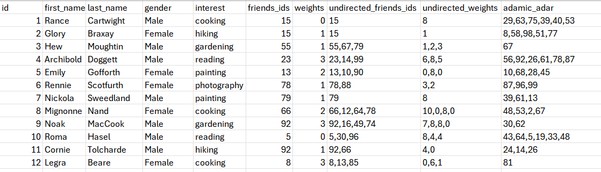
<figcaption>
Նկար 9
</figcaption>
</figure>

**Ուղղորդված և Չուղղորդված Կապերի Տարբերությունը**

Սկզբնական տվյալների բազայում friends_ids և weights սյունակները
ներկայացնում էին ուղղորդված գրաֆ։ Ուղղորդված գրաֆում կապն ունի
ուղղություն, եթե 1-ին օգտատերի friends_ids-ում գրված է 15, դա նշանակում
է, որ 1-ն ճանաչում է 15-ին, բայց դա ամենևին չի նշանակում, որ 15-ն էլ
ճանաչում է 1-ին կամ 1-ին համարում է իր ընկերը։ Այսինքն՝ կապը հոսում է
միայն մի ուղղությամբ, ինչպես մի շարք սոցիալական ցանցերում, որտեղ A-ն
կարող է հետևել B-ին, բայց B-ն կարող է ամենևին չհետևել A-ին։

Սա շատ հաճախ արտացոլում է ակտիվ ճանաչողության կամ նախաձեռնության
ասիմետրիան, մի մարդ կարող է ճանաչել մյուսին, ձգտել կապ հաստատել, կամ
ուղղակի ծանոթ համարել, սակայն հարաբերությունն ամբողջական ու փոխադարձ այն
ժամանակ է դառնում, երբ երկու կողմն էլ ճանաչում ու ընդունում է կապը։

Տեխնիկական տեսանկյունից չուղղորդված գրաֆ կառուցելու համար անհրաժեշտ է
անցնել ամբողջ ուղղորդված ցանցով և ամեն կող (i → j) դեպքում ավելացնել նաև
հակառակ կողը (j → i), եթե այն արդեն գոյություն չունի։ Արդյունքում
ձևավորվում է սիմետրիկ ու ամբողջական ցանց, որտեղ ոչ ոք մոռացված կամ
անտեսված չէ։

**Գրաֆի կառուցումը. գագաթներ, կողեր և կառուցվածք**

Տվյալների բազան ստանալուց հետո հաջորդ քայլն այն գրաֆի տեսքով
ներկայացնելն է։ Գրաֆը մաթեմատիկայի և համակարգչային գիտության հիմնարար
հասկացություն է, որը ծառայում է կառուցվածքների ու կապերի մոդելավորման
համար։

Մեր ցանցի համատեքստում գրաֆի յուրաքանչյուր գագաթ ներկայացնում է մեկ
օգտատիրոջ։ Այսպիսով, քանի որ ունենք 100 օգտատեր, գրաֆն ունի 100 գագաթ։
Կողերը ներկայացնում են ընկերական կապերը, այսինքն՝ եթե երկու օգտատեր
ընկերներ են, ապա նրանց համապատասխան գագաթների միջև գծվում է կող։

## 2․2 Louvain ալգորիթմ {#louvain-ալգորիթմ .DIplom-etnaglux .unnumbered}

Համայնքների հայտնաբերման բազմաթիվ ալգորիթմներ կան, սակայն Louvain
ալգորիթմն աչքի է ընկնում իր արդյունավետությամբ, արագությամբ և
ճշգրտությամբ։ Այն մշակվել է 2008 թ. Բելգիայի Լուվենի կաթոլիկ համալսարանի
(Université catholique de Louvain) հետազոտողների կողմից, ուստի կրում է
հենց այդ համալսարանի անունը։

Ալգորիթմն աշխատում է մոդուլայնության օպտիմալացման սկզբունքով։ Ամեն
անգամ, երբ ալգորիթմը փոփոխություն է կատարում ցանցի կառուցվածքում, այն
ստուգում է՝ արդյոք փոփոխությունն «ավելի լավ» դարձրեց ամբողջ ցանցի
բաժանումը, թե ոչ։ «Ավելի լավ» ասելով հասկանում ենք ավելի բարձր
մոդուլայնություն, ինչի մասին ավելի մանրամասն կխոսենք ստորև։

Համայնքի հայեցակարգը ցանցային վերլուծության մեջ ունի ինտուիտիվ, բայց
ճշգրիտ սահմանում։ Համայնքը գագաթների մի խումբ է, որի ներսում կողերն շատ
ավելի խիտ են, քան խմբից դուրս։ Այլ կերպ ասած՝ համայնքի անդամներն ավելի
շատ կապ ունեն իրենց հետ, քան օտարների հետ։

Կյանքում դա կարող է արտահայտվել հետևյալ կերպ․ մի խումբ մարդիկ, ովքեր
սովորել են նույն բուհում, հաճախ ավելի շատ կապ ունեն միմյանց հետ, քան
մյուս բոլոր մարդկանց հետ։ Կամ մի թաղամասի բնակիչներ ավելի շատ ճանաչում
են միմյանց, քան հեռու թաղամասերի բնակիչներին։ Հենց այս «բնական
կլաստերավորումն» է փնտրում համայնքների հայտնաբերման ալգորիթմը։

Ցանցի ճիշտ բաժանումը համայնքների կարևոր է բազմաթիվ պատճառներով. այն
թույլ է տալիս հասկանալ սոցիալական կառուցվածքը, կանխատեսել վարքագիծ,
նպատակային գովազդ ցուցաբերել կամ նույնիսկ հայտնաբերել կասկածելի
գործողություններ։

Louvain ալգորիթմն ունի նաև շատ կարևոր գործնական առավելություն. այն չի
պահանջում, որ կանխավ սահմանենք, թե քանի համայնք ենք ուզում ստանալ։ Շատ
ալգորիթմներ պահանջում են, որ ծրագրավորողն ինքը մատնանշի ենթախմբերի թիվը,
ինչը շատ դեպքերում անհայտ է կամ կամայական։ Louvain ալգորիթմն ինքն գտնում
է օպտիմալ թիվը՝ ելնելով ցանցի կառուցվածքից։

**Մոդուլայնություն**

Մոդուլայնությունը (Q) ցանցի բաժանման որակի թվային չափ է։ Այն ցույց է
տալիս, թե որքանով է կատարված բաժանումը ճիշտ ու բնական։

Ֆորմալ կերպով մոդուլայնությունը հաշվվում է հետևյալ բանաձևով.

$$Q\  = \ \left( \frac{1}{2m} \right) \cdot \ \sum_{\left\{ i = 1 \right\}}^{}{\sum_{\left\{ j = 1 \right\}}^{}{\ Aᵢⱼ\  - \frac{(kᵢ\ kⱼ)}{2m}}} \cdot \ \delta(cᵢcⱼ)$$

Այս բանաձևը տարածվում է ամբողջ գրաֆի վրա։ Այսինքն ՝ այն հաշվում է ոչ թե
համայնքի մոդուլայնությունը այլ ամբողջ գրաֆի։

$Aᵢⱼ$ --- Հարևանության մատրիցի տարրն է։ Եթե i-րդ և j-րդ օգտատերերի միջև
կա կապ, ապա $Aᵢⱼ$ = 1, եթե չկա՝ $Aᵢⱼ$ = 0։ Ամբողջ ցանցը կարելի է
ներկայացնել որպես 100×100 չափերով մատրից, որտեղ յուրաքանչյուր բջիջ ցույց
է տալիս, կա՞ ընկերություն երկու օգտատերերի միջև, թե ոչ։ Բայց, ինչպես
կտեսնենք ավելի ուշ, գործնականում ամբողջ մատրիցն ստեղծելը ոչ միշտ է
անհրաժեշտ։

m --- Գրաֆի բոլոր կողերի ընդհանուր թիվն է։ Օրինակ, եթե 100 օգտատերերի
ցանցում կա ընդհանուր 300 ընկերական կապ, ապա m=300։ Այս թիվը բանաձևում
հայտնվում է նորմալացման համար, այսինքն՝ արդյունքը կախված չի լինի ցանցի
մեծությունից։

$\frac{(kᵢ\ kⱼ)}{2m} - \ $Այս արտահայտությունը ցույց է տալիս ակնկալվող
կողերի թիվը i-ին և j-ին միացնող դեպքում, ենթադրելով, որ կողերը բաշխված
են պատահականորեն։ Այստեղ $kᵢ$-ն i-րդ գագաթի աստիճանն է, այսինքն՝ նրա
ընկերների թիվը

$\delta(cᵢcⱼ)$= $\left\{ \begin{array}{r}
1,\ \ \ i = j \\
0,\ \ \ i \neq j
\end{array} \right.\ $ Կրոնեկերի դելտա ֆունկցիան է որը հավասար է 1-ի,
երբ i-ն ու j-ն նույն համայնքում են, և 0-ի, երբ տարբեր համայնքներում են։
Սա ապահովում է, որ բանաձևը հաշվի առնի միայն ներ-համայնքային կապերը, ոչ
թե ողջ ցանցը։

Դրական Q նշանակում է, որ ներ-համայնքային կապերն ավելի շատ են, քան ռանդոմ
ցանցից կսպասեինք, ինչն էլ ցույց է տալիս, որ բաժանումը ճիշտ է։ Q-ի արժեքը
տատանվում է 0-ից 1-ի սահմաններում, ընդ որում 0.3-ից բարձր արժեքները
համարվում են ուժեղ, լավ կառուցվածքային բաժանման ցուցիչ։

**Տեղային օպտիմալացում**

Տեղային օպտիմալացման գործակցի հիման վրա է որոշվում՝ արդյոք նպատակահարմար
է գագաթի տեղափոխությունը մեկ այլ համայնք։ Մեկից ավելի համայնք դիտարկելու
դեպքում փոփոխությունը կատարվում է առավել բարձր գործակցով համայնքի օգտին,
ինչպես նաև հավասար գործակիցներ ունենալու դեպքում փոփոխությունն
իրականացվում է առաջինի օգտին։

$$\mathrm{\Delta}Q = \frac{k_{i,in}}{m}\  - \ \frac{\sum_{tot}k_{i}}{2m^{2}}\ $$

$k_{i,in}$ -- Գագաթի այն ատիճանների քանակն է, որորնք պատկանում այդ
համայնքին

$\sum_{tot} -$ Համայնքի բոլոր գագաթների աստիճանների գումարն է

$k_{i} -$ Գագաթի աստիճան

m -- Գրաֆի բոլոր կողերի թիվ

**Ալգորիթմի աշխատանքը**

Louvain ալգորիթմի աշխատանքը ամենահեշտ հասկանալ այն երևակայելով որպես
բանակցային գործընթաց, որտեղ ցանցի յուրաքանչյուր անդամ «որոշում» է, թե
ո՞ր խմբին ուզում է պատկանել, ելնելով զուտ կապերի ու հաշվարկների
տրամաբանությունից։

Սկզբնական փուլ. Ալգորիթմն սկսում է ամենապարզ հնարավոր բաժանումով.
յուրաքանչյուր գագաթ ձևավորում է իր առանձին, եզակի համայնքը։ Ուրեմն, 100
գագաթ ունենք, 100 համայնք ունենք։ Ամեն «համայնք» պարունակում է ընդամենը
մեկ անդամ։ Այս փուլում ոչ մի ընկեր ոչ ոքի հետ նույն խմբում չէ, Q-ն = 0
է, և ամեն ինչ ճիշտ է։ Սա ելակետն է, որտեղից ալգորիթմը կսկսի բարելավել
ամեն ինչ։

Ստուգման փուլ. Ալգորիթմն ընտրում է ցանկացած գագաթ և ստուգում է նրա բոլոր
կողերը, այսինքն՝ ցանկը, թե ու՞մ հետ է նա ընկեր։ Ենթադրենք օգտատերը ունի
ընկերներ, ալգորիթմն հարց է տալիս. «Ի՞նչ կփոխվի, եթե օգտատիրոջը տեղափոխվի
ընկերոջ համայնք»։ Հաշվում է ΔQ = Q₁ - Q₀, այսինքն՝ նոր
մոդուլայնությունից հանում է հին մոդուլայնությունը։ Եթե ΔQ \> 0, ապա
տեղափոխությունն «ավելի լավ» է դարձնում ամբողջ ցանցի բաժանումը, ուրեմն
այն կատարվում է։

Եթե օգտատերն ունի մի քանի ընկեր, ալգորիթմն ընտրում է ամենամեծ ΔQ-ն, ու
օգտատիրոջը միացնում է հենց այդ ընկերոջ համայնքին։ Ի դեպ, օգտատերը կմնա
ներկայիս համայնքում, եթե բոլոր ΔQ-ները բացասական են կամ հավասար 0-ի,
ինչը կնշանակի, որ ոչ մի տեղափոխություն ոչ մի ուղղությամբ ձեռնտու չէ։

Կրկնությունը**.** Ալգորիթմն անցնում է բոլոր 100 գագաթներով, մեկ-մեկ
ստուգելով ու, անհրաժեշտության դեպքում, տեղափոխելով։ Մեկ ամբողջ շրջան
ավարտելուց հետո, ալգորիթմը կրկին անցնում է բոլոր գագաթներով, ու նորից
ստուգում, արդյոք ինչ-որ մեկն ուզում է փոխել համայնք։ Այս կրկնությունը
շարունակվում է այնքան ժամանակ, մինչ ոչ մի գագաթ տեղափոխության կարիք չի
ունենում, ինչը նշանակում է, որ ամբողջ ցանցն այժմ օպտիմալ բաժանված է։

Կան ցանցեր, որտեղ կողերի մասին տեղեկատվությունը ի սկզբանե անհայտ է, ու
ալգորիթմն ստիպված է օգտագործել հարևամությամ մատրիցիան։ Բայց մեր դեպքում
friends_ids դաշտն ուղղակիորեն ասում է, թե ո՛ր գագաթներն են կապված։
Ուրեմն ամբողջ 100×100 = 10,000 բջջանոց մատրիցը ստեղծելն ոչ միայն ոչ
անհրաժեշտ է, այլ նաև ռեսուրսատար։ Փոխարենն ավելի արդյունավետ է
ուղղակիորեն հաշվել մոդուլայնությունը կողեր ունեցող զույգ գագաթների
համար, շրջանցելով ամբողջ ոչ-կապված զույգերը, ու կենտրոնանալ բացառապես ու
ամբողջությամբ ընկերական կապերի ուժի ու ձևի վրա։

Louvain ալգորիթմն, ըստ իր բնույթի, ամենաճիշտ ու ամենաէֆֆեկտիվ է աշխատում
չուղղորդված, կշռված գրաֆի վրա։ Ահա թե ինչու undirected_friends_ids ու
undirected_weights ավելացնելը ոչ թե ֆորմալ բարելավում է, այլ կոնցեպտուալ
անհրաժեշտություն. ալգորիթմի մոդուլայնության բանաձևն ամբողջ ուժով
կաշխատի, երբ հարևանության մատրիցն սիմետրիկ է։ Հենց
undirected_friends_ids-ն է ապահովում, որ ամբողջ մատրիցի յուրաքանչյուր
կողը ու հակառակ կողը հավասար ու առկա են, ինչը Q-ի հաշվարկն ճշգրիտ ու
անկողմնակալ է դարձնում։

## 2․3 Adamic-Adar index Ալգորիթմ {#adamic-adar-index-ալգորիթմ .DIplom-etnaglux .unnumbered}

Adamic-Adar index-ը հասկանալու համար անհրաժեշտ է նախ ամուր հիմք դնել
գրաֆների տեսության մեջ, քանի որ ամբողջ մեթոդաբանությունը կառուցված է այդ
մաթեմատիկական ապարատի վրա։

Գրաֆ $G$-ն սահմանվում է որպես զույգ $\left( V,E \right)$, որտեղ $V$-ն
հանգույցների բազմությունն է, իսկ $E$-ն՝ կողերի բազմությունը, այնպես, որ
$E \subseteq V \times V$։ Սոցիալական ցանցերի համատեքստում հանգույցները
ներկայացնում են անձինք կամ օբյեկտներ, իսկ կողերը՝ նրանց միջև եղած
կապերը։

Adamic-Adar index-ը կիրառվում է անուղղորդ գրաֆների վրա, ինչը նշանակում
է, որ եթե $u$ հանգույցն ու $v$ հանգույցը կապված են, ապա կապը երկկողմանի
է. $(u,v) \in E \Leftrightarrow (v,u) \in E$։ Սա համապատասխանում է այն
ցանցերին, որտեղ ծանոթությունը փոխադարձ է, ի տարբերություն հետևորդ
հարաբերության, որն ուղղորդված է։

$u$ հանգույցի հարևանների բազմությունը սահմանվում է հետևյալ կերպ.

$$N(u) = \{ w \in V:(u,w) \in E\}
$$

Այսինքն՝ $N(u)$-ն պարունակում է բոլոր այն հանգույցները, որոնք ուղղակի
կողով կապված են $u$-ի հետ։ Ուշադրության արժանի է, որ սովորաբար
$u \notin N(u)$, այսինքն՝ հանգույցը չի համարվում ինքն իրեն հարևան։

$u$ հանգույցի աստիճանն սահմանվում է որպես հարևանների բազմության
հզորություն.

$$d(u) = \mid N(u) \mid 
$$

Աստիճանն ամենահիմնարար կառուցվածքային հատկանիշն է գրաֆի ցանկացած
հանգույցի համար, և, ինչպես կտեսնենք, հենց Աստիճանն է կրում Adamic-Adar
index-ի հիմնական տեղեկատվական բեռը։

Adamic-Adar index-ի հիմնական գաղափարն է՝ քիչ կապ ունեցող ընդհանուր
հարևանն ավելի ուժեղ ազդանշան է, քան շատ կապ ունեցողը։

Այս պնդումը կարելի է բացատրել հետևյալ կերպ։ Ենթադրենք կա $z$ անձ, ում
ճանաչում է ամբողջ քաղաքը՝ 10,000 մարդ։ Եթե $u$-ն ու $v$-ն երկուսն էլ
ծանոթ են $z$-ի հետ, դա գրեթե ոչինչ չի ասում $u$-ի ու $v$-ի հարաբերության
մասին, քանի որ $z$-ն ծանոթ է բոլորի հետ։ Հիմա ենթադրենք կա $w$ անձը, ում
ճանաչում է ընդամենը 3 մարդ, և $u$-ն ու $v$-ն երկուսն էլ այդ 3 մարդու
թվում են։ Սա արդեն ուժեղ ազդանշան է. $u$-ն ու $v$-ն պատկանում են $w$-ի
նեղ շրջապատին, ինչը ենթադրում է, որ նրանք ամուր կապ ունեն իրար հետ։

Adamic-Adar index-ը $u$ և $v$ հանգույցների համար սահմանվում է հետևյալ
կերպ.

$$AA(u,v) = \sum_{z \in N(u) \cap N(v)}^{}\frac{1}{\log \mid N(z) \mid}
$$

$N(u) \cap N(v)$--- Գտնել $u$-ի ու $v$-ի ընդհանուր հարևանների
բազմությունը։ Սա այն հանգույցների ամբողջությունն է, որոնք ուղղակիորեն
կապված են թե $u$-ի, թե $v$-ի հետ։

$\mid N(z) \mid$--- Յուրաքանչյուր ընդհանուր հարևան $z$-ի համար հաշվել
աստիճանն, այսինքն\` թե $z$-ն ընդամենը ինչ֊քան հանգույցի հետ է կապված
ամբողջ գրաֆում (ոչ միայն $u$-ի ու $v$-ի հետ)։

$\log \mid N(z) \mid$--- Կիրառել լոգարիթմ աստիճանի վրա։ Լոգարիթմն ճնշում
է մեծ աստիճանների ազդեցությունը, որ չափային ռեժիմն ողջամիտ մնա։

$\frac{1}{\log \mid N(z) \mid}$--- Ինվերտել արժեքը։ Հիմա մեծ աստիճանն
տալիս է փոքր կշիռ, փոքր աստիճանն ՝ մեծ կշիռ։

$\sum$--- Գումարել բոլոր ընդհանուր հարևանների կշիռները։ Արդյունքը
$AA(u,v)$-ի գործակիցն է։

<figure>
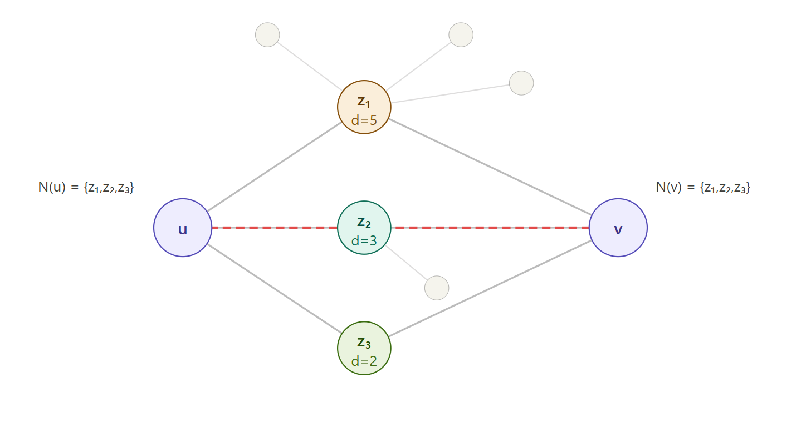
<figcaption>
Նկար 10
</figcaption>
</figure>

Ցանցում ունենք.

> $u$ հանգույց, $N(u) = \{ z_{1},z_{2},z_{3}\}$
>
> $v$ հանգույց, $N(v) = \{ z_{1},z_{2},z_{3}\}$
>
> $z_{1}$--- աստիճան 5 (կապված է $u$-ի, $v$-ի և 3 այլ հանգույցների հետ)
>
> $z_{2}$--- աստիճան 3 (կապված է $u$-ի, $v$-ի և 1 այլ հանգույցի հետ)
>
> $z_{3}$--- աստիճան 2 (կապված է միայն $u$-ի ու $v$-ի հետ)

$${z_{2}\text{-ի }\text{ներդրումը} = \frac{1}{\ln(3)} = \frac{1}{1.0986} \approx 0.9102
}{z_{3}\text{-ի }\text{ներդրումը} = \frac{1}{\ln(2)} = \frac{1}{0.6931} \approx 1.4427
}{AA(u,v) = 0.6213 + 0.9102 + 1.4427 = 2.9742
}$$

Ուշադրություն դարձնենք, թե ինչ է տեղի ունենում. $z_{3}$-ն, ով աստիճանի
տեսանկյունից ամենաթույլ հանգույցն է (ընդամենը 2 կապ), ամենամեծ կշիռն է
ստանում՝ 1.4427, մինչ $z_{1}$-ն, ով 5 կապ ունի, ամենաքիչ կշիռն է
ստանում՝ 0.6213։

Ստորև աղյուսակում ցույց է տրված, թե ինչպես է $\frac{1}{\ln(d)}$ արժեքը
փոխվում աստիճանի աճի հետ.

  -----------------------------------------------------------------------------------
    Աստիճան $d$     $$\ln(d)$$   $$\frac{1}{\ln(d)}$$         Մեկնաբանություն
  ---------------- ------------ ---------------------- ------------------------------
         2            0.693             1.4427                 Շատ բարձր կշիռ

         3            1.099             0.9102                   Բարձր կշիռ

         5            1.609             0.6213                   Միջին կշիռ

         10           2.303             0.4343                Ցածր-միջին կշիռ

         50           3.912             0.2557                   Ցածր կշիռ

        100           4.605             0.2171                 Շատ ցածր կշիռ

        1000          6.908             0.1448                 Գրեթե անտեսելի
  -----------------------------------------------------------------------------------

  : Adamic-Adar index-ի շեմային աղյուսակ

Ինչ հետևություն կարելի է անել. $d = 2$-ից $d = 1000$ անցնելիս կշիռն
ընկնում է 1.4427-ից մինչև 0.1448, այսինքն՝ $\sim$`<!-- -->`{=html}10
անգամ։ Աստիճանն աճում է 500 անգամ, բայց կշիռն ընկնում է ընդամենը 10
անգամ՝ շնորհիվ լոգարիթմի մեղմող ազդեցության։ Սա կարևոր հատկանիշ է.
Adamic-Adar index-ը կշռում է ազդեցությունը, բայց ոչ ամբողջությամբ
վերացնում մեծ աստիճնների ներդրումը։

# ԳԼՈՒԽ 3․ ԾՐԱԳՐԱՅԻՆ ՄԱՍ {#գլուխ-3-ծրագրային-մաս .unnumbered}

## 3․1 Օգտագործվող գրադարաններ {#օգտագործվող-գրադարաններ .DIplom-etnaglux .unnumbered}

**Pandas գրադարան**

Pandas-ի հիմնական նպատակն է տրամադրել արագ, հարմար և արտահայտիչ
կառուցվածքներ՝ կառուցվածքային և ժամաշարային տվյալների հետ աշխատելու
համար։ Այն հատկապես հարմար է տվյալների մաքրման, փոխակերպման,
ագրեգացիայի, միավորման և վիզուալիզացիայի նախնական փուլի համար։ Pandas-ը
կամուրջ է հանդիսանում հում տվյալների և վերլուծության մոդելների միջև։

Pandas-ն ունի երեք հիմնական տվյալների կառուցվածք։

Series-ը միաչափ կառուցվածք է, որը նման է ցուցակի, բայց ունի ինդեքս։
Կարելի է պատկերացնել որպես Excel-ի մեկ սյուն։ Ամեն տարր ունի թե՛ արժեք,
թե՛ պիտակ։

DataFrame-ը երկչափ կառուցվածք է, աղյուսակ տողերով և սյուներով։ Սա
Pandas-ի ամենակարևոր կառուցվածքն է։ Կարելի է պատկերացնել որպես Excel-ի
թերթ, SQL աղյուսակ, կամ Series-ների բառարան։ Ամեն սյուն Series է, բոլոր
սյուները կիսում են նույն ինդեքսը։

Index-ը տողերի և սյուների պիտակների կառուցվածք է։ Կարող է լինել թվային,
տեքստային, ժամանակային և այլ։

**NetworkX գրադարան**

NetworkX գրադարանը նախատեսված է գրաֆների ստեղծման, ուսումնասիրության և
վերլուծության համար։ Այն Python-ում գրաֆների տեսության ամենահայտնի
գործիքներից մեկն է։ NetworkX-ը հնարավորություն է տալիս ստեղծել ինչպես
փոքր, այնպես էլ շատ մեծ ցանցեր և իրականացնել դրանց վրա տարբեր
ալգորիթմներ։ NetworkX-ը թույլ է տալիս նաև պահպանել գրաֆները տարբեր
ֆորմատներով և փոխանակել դրանք այլ ծրագրերի հետ։

**Matplotlib գրադարան**

Matplotlib գրադարանը Python-ում տվյալների վիզուալիզացիայի հիմնական
գործիքներից մեկն է։

Matplotlib-ը թույլ է տալիս պատկերել տվյալները տեսողական ձևով, ինչը
կարևոր է տվյալների վերլուծության և արդյունքների ներկայացման համար։
Գրադարանը ապահովում է բազմաթիվ տեսակի գրաֆիկներ, օրինակ՝
գծայինգրաֆիկներ, սյունակագծային դիագրամներ, ցրման, դիագրամների,
հիստոգրամներ, շրջանագծային, դիագրամներ,ջերմային քարտեզներ

Այս գրադարանը հաճախ օգտագործվում է գիտական հետազոտություններում,
վիճակագրական վերլուծության մեջ և մեքենայական ուսուցման նախագծերում։ Այն
նաև լավ ինտեգրված է pandas և NumPy գրադարանների հետ, ինչը թույլ է տալիս
տվյալների վերլուծությունից անմիջապես անցնել դրանց վիզուալիզացիային։

Matplotlib-ը նաև ապահովում է գրաֆիկների մանրամասն կարգավորում՝ թույլ
տալով փոխել գույները, մակագրությունները, առանցքները և բազմաթիվ այլ
պարամետրեր։

**Community Louvain գրադարան**

python-louvain գրադարանը օգտագործվում է գրաֆներում համայնքների
հայտնաբերման համար՝ կիրառելով Louvain algorithm ալգորիթմը։ Community
Louvain գրադարանը սովորաբար օգտագործվում է NetworkX գրաֆների հետ միասին։
Այն ավտոմատ կերպով բաժանում է ցանցը մի քանի համայնքների՝ հաշվի առնելով
կապերի կառուցվածքը և կշիռները։

## 3․2 Հիմնական ծրագիր {#հիմնական-ծրագիր .DIplom-etnaglux .unnumbered}

Ամբողջական ծրագիրը հասանելի է այս հղումով ՝
<https://github.com/Tigran8880/Diplom/blob/main/Louvain_code.py>

## 3․3 Ծրագրային արտածում {#ծրագրային-արտածում .DIplom-etnaglux .unnumbered}

## 3․3.1 Ուղղորդված գրաֆի արտածում {#ուղղորդված-գրաֆի-արտածում .sun-sub .unnumbered}

<figure>
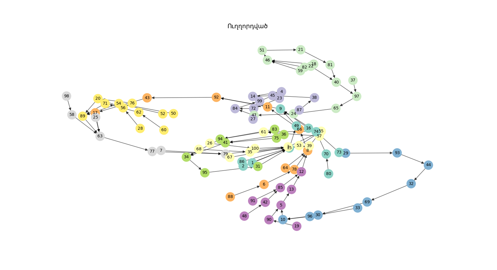
<figcaption>
Ուղղորդված գրաֆ
</figcaption>
</figure>

Համայնք 0 (size=11): \[1, 15, 2, 9, 49, 16, 70, 74, 73, 80, 86\]

Համայնք 1 (size=11): \[3, 55, 26, 100, 35, 39, 53, 61, 57, 67, 68\]

Համայնք 2 (size=10): \[4, 23, 14, 72, 27, 99, 38, 45, 84, 87\]

Համայնք 7 (size=9): \[5, 13, 12, 19, 90, 42, 85, 48, 91\]

Համայնք 4 (size=10): \[6, 78, 8, 66, 92, 11, 17, 43, 64, 88\]

Համայնք 6 (size=7): \[7, 79, 63, 25, 58, 77, 98\]

Համայնք 3 (size=9): \[10, 29, 93, 30, 32, 69, 33, 96, 44\]

Համայնք 8 (size=14): \[18, 46, 21, 81, 22, 40, 24, 47, 37, 97, 51, 59,
65, 82\]

Համայնք 9 (size=11): \[20, 89, 28, 56, 50, 54, 52, 60, 62, 71, 76\]

Համայնք 5 (size=8): \[31, 34, 95, 36, 41, 94, 75, 83\]

Արտածումը ցույց է տալիս 100 օգտատերերի տրամաբանական բաժանումն ըստ
համայնքների։ Նույն համայնքի ցանկացած օգտատեր ներկված է նույն գույնով,
ինչպես նաև առանձին արտածված է համայնքների պարունակությունը։ Սլաքներով
ցույց է տրված յուրաքանչյուր օգտատիրոջ կապը այլ օգտատիրոջ հետ։ Այս
տարբերակը ցույց է տալիս թե՛ ամբողջական գրաֆը, թե՛ ենթագրաֆերի
առկայությունը։ Գրաֆերի տեսքով այս մոդելավորումը թույլ է տալիս թվային
տվյալներից անցում կատարել գրաֆիկականի, որն էլ իր հերթին ավելի հարմար է
մարդու տեսանկյունից ամբողջ ցանցի ուսումնասիրման համար։

Ուղղորդված գրաֆի վրա կիրառված համայնքների հայտնաբերման ալգորիթմի
արդյունքում ստացվել է 10 համայնք։ Համայնքների չափերը տատանվում են 7-ից
մինչև 14 հանգույց, ինչը վկայում է բաժանման համեմատաբար համաչափ բնույթի
մասին։ Ամենամեծ համայնքը Համայնք 8-ն է (14 հանգույց), ամենափոքրը՝
Համայնք 6-ը (7 հանգույց)։

## 3.3.2 Ուղղորդված քաշով գրաֆի արտածում {#ուղղորդված-քաշով-գրաֆի-արտածում .sun-sub .unnumbered}

<figure>
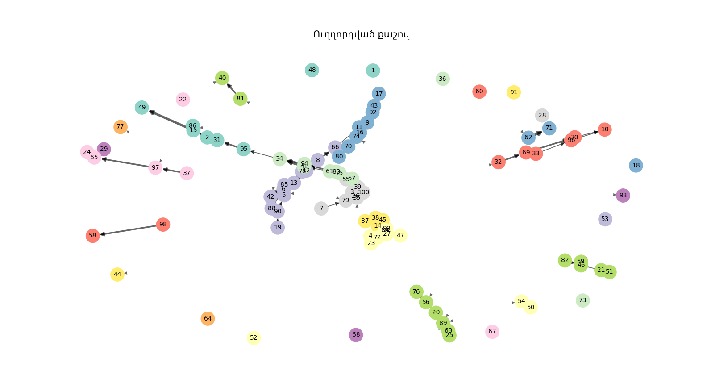
<figcaption>
Ուղղորդված քաշով գրաֆ
</figcaption>
</figure>

Համայնք 0 (size=1): \[1\]

Համայնք 1 (size=6): \[15, 2, 49, 31, 95, 86\]

Համայնք 22 (size=8): \[3, 55, 7, 79, 26, 100, 35, 39\]

Համայնք 4 (size=7): \[4, 23, 72, 47, 27, 99, 84\]

Համայնք 7 (size=12): \[5, 13, 6, 78, 8, 66, 12, 19, 90, 42, 85, 88\]

Համայնք 11 (size=9): \[9, 92, 11, 16, 17, 43, 70, 74, 80\]

Համայնք 9 (size=6): \[10, 30, 32, 69, 33, 96\]

Համայնք 30 (size=4): \[14, 38, 45, 87\]

Համայնք 16 (size=6): \[63, 20, 89, 25, 56, 76\]

Համայնք 13 (size=1): \[18\]

Համայնք 17 (size=5): \[46, 21, 51, 59, 82\]

Համայնք 18 (size=2): \[81, 40\]

Համայնք 19 (size=1): \[22\]

Համայնք 20 (size=4): \[24, 37, 97, 65\]

Համայնք 23 (size=1): \[28\]

Համայնք 24 (size=1): \[29\]

Համայնք 25 (size=1): \[93\]

Համայնք 27 (size=7): \[34, 41, 61, 57, 94, 75, 83\]

Համայնք 29 (size=1): \[36\]

Համայնք 32 (size=1): \[44\]

Համայնք 2 (size=1): \[48\]

Համայնք 3 (size=2): \[50, 54\]

Համայնք 5 (size=1): \[52\]

Համայնք 6 (size=1): \[53\]

Համայնք 8 (size=2): \[58, 98\]

Համայնք 10 (size=1): \[60\]

Համայնք 12 (size=2): \[62, 71\]

Համայնք 14 (size=1): \[77\]

Համայնք 15 (size=1): \[64\]

Համայնք 21 (size=1): \[67\]

Համայնք 26 (size=1): \[68\]

Համայնք 28 (size=1): \[73\]

Համայնք 31 (size=1): \[91\]

Ի տարբերություն նախորդի, այս մոդելում առկա են քաշեր։ Քաշերի
առկայությունն էապես փոխում է գրաֆի կառուցվածքը և ի հայտ է բերում
մեկուսացած գագաթներ։ Ուժեղ կապերը ցույց են տրված ավելի մգեցված գծերով։
Առկա են գագաթներ, որոնք ունեն իրենց մեջ մտնող սլաք, բայց չունեն այդ
սլաքին համապատասխան գագաթը։ Հենց սա էլ ցույց է տալիս կապի որակը.
այսինքն՝ բավարար չէ ունենալ կապ, այլ հարկավոր է, որ այդ կապի քաշը լինի
բարձր։ Այս մոդելով մենք կարող ենք տարբերել իրական օգտատերերին կեղծ
օգտատերերից, ինչպես նաև ցանցի տեսանկյունից ավելի ճշգրիտ համայնքներ
կազմել։

## 3.3.3 Ոչ ուղղորդված գրաֆի արտածում {#ոչ-ուղղորդված-գրաֆի-արտածում .sun-sub .unnumbered}

<figure>
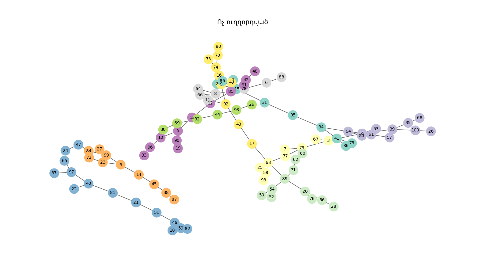
<figcaption>
Ոչ ուղղորդված գրաֆ
</figcaption>
</figure>

Համայնք 0 (size=10): \[1, 15, 2, 31, 86, 95, 34, 41, 36, 75\]

Համայնք 1 (size=9): \[3, 67, 79, 7, 63, 25, 58, 98, 77\]

Համայնք 2 (size=11): \[55, 26, 100, 94, 35, 39, 68, 53, 61, 57, 83\]

Համայնք 4 (size=10): \[4, 23, 14, 99, 45, 72, 27, 38, 87, 84\]

Համայնք 7 (size=12): \[5, 13, 10, 90, 12, 96, 85, 19, 33, 42, 48, 91\]

Համայնք 6 (size=7): \[6, 78, 88, 8, 66, 64, 11\]

Համայնք 9 (size=10): \[9, 92, 16, 49, 74, 17, 43, 70, 80, 73\]

Համայնք 5 (size=6): \[30, 29, 93, 69, 32, 44\]

Համայնք 3 (size=14): \[18, 46, 21, 81, 51, 22, 40, 24, 47, 65, 37, 97,
59, 82\]

Համայնք 8 (size=11): \[20, 89, 56, 76, 28, 50, 54, 52, 60, 62, 71\]

Ոչ ուղղորդված գրաֆի վրա կիրառված համայնքների հայտնաբերման ալգորիթմի
արդյունքում ստացվել է 10 համայնք՝ ընդհանուր 100 հանգույցով։ Համայնքների
չափերը տատանվում են 6-ից մինչև 14 հանգույց՝ ցուցաբերելով համաչափ և
հավասարակշռված բաժանում։ Քանի որ գրաֆը մոդելավորում է սոցիալական ցանց՝
ընկերության երկկողմանի կապերով, ստացված համայնքները կարելի է մեկնաբանել
որպես օգտատերերի բնական խմբեր, որտեղ յուրաքանչյուր անդամ ճանաչում է խմբի
մյուս անդամներին։ Ամենամեծ համայնքը Համայնք 3-ն է (14 հանգույց), որը
ներկայացնում է ամենախիտ սոցիալական խումբը, իսկ ամենափոքրները՝ Համայնք
5-ը և Համայնք 6-ը (համապատասխանաբար 6 և 7 հանգույց)։

Ի տարբերություն ուղղորդված գրաֆի, որտեղ կապերն ունեն հստակ ուղղություն,
ոչ ուղղորդված գրաֆում բոլոր կապերը փոխադարձ են, ինչի շնորհիվ ալգորիթմն
ավելի հստակ և կայուն համայնքներ է ձևավորում։ Վիզուալիզացիայում
հանգույցները հավասարաչափ բաշխված են՝ առանց մեկուսացված համայնքների, ինչը
վկայում է գրաֆի բավարար կապակցվածության մասին։

## 3.3.4 Ոչ ուղղորդված քաշով գրաֆի արտածում {#ոչ-ուղղորդված-քաշով-գրաֆի-արտածում .sun-sub .unnumbered}

<figure>
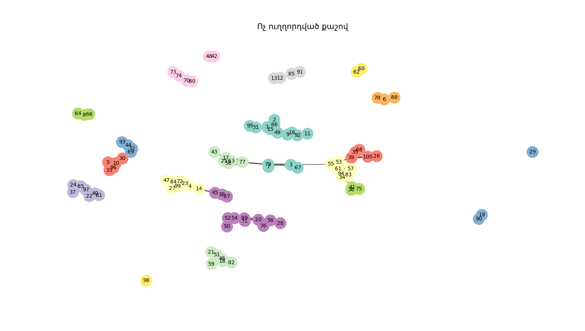
<figcaption>
Ոչ ուղղորդված քաշով գրաֆ
</figcaption>
</figure>

Համայնք 0 (size=11): \[1, 15, 2, 9, 92, 16, 49, 11, 31, 86, 95\]

Համայնք 1 (size=4): \[3, 67, 79, 7\]

Համայնք 2 (size=7): \[55, 34, 94, 53, 61, 57, 83\]

Համայնք 3 (size=8): \[4, 23, 14, 99, 72, 47, 27, 84\]

Համայնք 6 (size=5): \[5, 10, 30, 96, 33\]

Համայնք 14 (size=4): \[13, 12, 85, 91\]

Համայնք 8 (size=2): \[90, 19\]

Համայնք 9 (size=3): \[6, 78, 88\]

Համայնք 10 (size=3): \[8, 66, 64\]

Համայնք 12 (size=4): \[74, 70, 80, 73\]

Համայնք 15 (size=3): \[45, 38, 87\]

Համայնք 17 (size=6): \[17, 63, 43, 25, 58, 77\]

Համայնք 18 (size=6): \[18, 46, 21, 51, 59, 82\]

Համայնք 16 (size=9): \[20, 89, 56, 76, 28, 50, 54, 52, 71\]

Համայնք 4 (size=7): \[81, 22, 40, 24, 65, 37, 97\]

Համայնք 5 (size=5): \[26, 100, 35, 39, 68\]

Համայնք 7 (size=5): \[29, 93, 69, 32, 44\]

Համայնք 11 (size=3): \[41, 36, 75\]

Համայնք 13 (size=2): \[42, 48\]

Համայնք 19 (size=1): \[98\]

Համայնք 20 (size=2): \[60, 62\]

Սա համայնքների բաժանման ամենաճշգրիտ մոդելներից մեկն է, քանի որ
արտացոլում է ամբողջ ցանցի պատկերը։ Այս տվյալների հիման վրա կարող ենք
պարզել իրական ամենաակտիվ և ամենամեծ խմբերը։ Ոչ մի օգտատեր չի կարող
պատահականորեն ներառված լինել համայնքում կամ լինել պասիվ օգտատեր, ինչպես
նաև քաշի առկայությունը հնարավորություն է տալիս ստեղծել ավելի շատ, բայց
ամուր կապերով համայնքներ։

## 3.3.5 Adamic-Adar ինդեքսի արտածում {#adamic-adar-ինդեքսի-արտածում .sun-sub .unnumbered}

  -----------------------------------------------------------------------
          Օգտատիրոջ id              Ընկերոջ id             Գործակից
  ---------------------------- --------------------- --------------------
               27                       80                 2.06403

               52                       68                 2.000806

               32                       57                 1.964017

               96                       99                 1.820478

               22                       36                 1.820478

               42                       84                 1.820478

               53                       76                 1.631587

               25                       45                 1.531574

               19                       33                 1.46835

               19                       78                 1.442695

               58                       88                 1.442695

               30                       38                 1.442695

               27                       90                 1.442695

               43                       61                 1.442695

               13                       100                1.442695

               26                       39                 1.442695

               60                       73                 1.442695

               25                       94                 1.442695

               30                       62                 1.442695

               13                       61                 1.391138

               44                       97                 1.342682

               6                        47                 1.342682

               97                       98                 1.342682
  -----------------------------------------------------------------------

  : Adamic-Adar ալգորիթմով մշակված տվյալների արդյունք

Տվյալների քանակի չափազանց մեծ լինելու պատճառով կարտածենք արդյունքների մի
մասը՝ մեծից փոքր դասավորված։ Համապատասխան օգտատիրոջ կողքին նշված է մյուս
օգտատիրոջ համարը և նրանց ընդհանուր ընկերների հիման վրա ստեղծված
գործակիցը։ Սա ցույց է տալիս, թե երկու օգտատերերի միջև անմիջական կապ չկա,
բայց նրանց ընդհանուր ընկերների առկայության հիման վրա գոյություն ունի մեծ
հավանականություն, որ նրանք նույնպես ունեն բոլոր նախադրյալները կապ
ստեղծելու համար։

# **Գլուխ 4․** Գրաֆների տեսության միջոցով ձեռնարկության աշխատանքի անվտանգության կառավարման համակարգի վիճակի գնահատում {#գլուխ-4-գրաֆների-տեսության-միջոցով-ձեռնարկության-աշխատանքի-անվտանգության-կառավարման-համակարգի-վիճակի-գնահատում .unnumbered}

Ժամանակակից ձեռնարկություններում աշխատանքի անվտանգության ապահովումը
կարևորագույն խնդիրներից է։ Արտադրական գործընթացներում աշխատողների
անվտանգությունն ու առողջությունը կախված են այն բանից, թե որքան
արդյունավետ է կազմակերպված աշխատանքի անվտանգության կառավարման համակարգը։
Այդ համակարգը ներառում է տարբեր գործոններ՝ տեխնիկական սարքավորումներ,
աշխատողների պատրաստվածություն, վերահսկողություն, անվտանգության կանոնների
պահպանում և այլ բաղադրիչներ։

Աշխատանքի անվտանգության կառավարման համակարգի արդյունավետությունը
գնահատելու համար կիրառվում են տարբեր մեթոդներ։ Դրանցից մեկը գրաֆների
տեսության կիրառումն է, որը թույլ է տալիս ուսումնասիրել համակարգի տարրերի
միջև կապերը և գնահատել դրանց ազդեցությունը ամբողջ համակարգի վրա։

Գրաֆների տեսությունը մաթեմատիկական գործիք է, որը լայնորեն օգտագործվում է
տարբեր ոլորտներում՝ համակարգչային գիտություն, տրանսպորտ, սոցիալական
ցանցերի վերլուծություն, ինչպես նաև արտադրական համակարգերի
ուսումնասիրություն։ Այդ տեսության օգնությամբ հնարավոր է պատկերել բարդ
համակարգերը որպես գագաթներից և կողերից կազմված կառուցվածք և
ուսումնասիրել դրանց փոխազդեցությունը։

Այս աշխատանքի նպատակն է ուսումնասիրել, թե ինչպես կարելի է գրաֆների
տեսության միջոցով գնահատել ձեռնարկության աշխատանքի անվտանգության
կառավարման համակարգի վիճակը։

**Աշխատանքի անվտանգության կառավարման համակարգի հիմնական բաղադրիչները**

Աշխատանքի անվտանգության կառավարման համակարգը (ԱԱԿՀ) կազմակերպությունում
նախատեսված միջոցառումների և գործընթացների ամբողջությունն է, որը
ապահովում է աշխատողների անվտանգությունը և նվազեցնում արտադրական
վտանգները։

Այդ համակարգը սովորաբար ներառում է հետևյալ հիմնական տարրերը․

> Անվտանգության քաղաքականություն -- կազմակերպության ընդհանուր մոտեցումը
> անվտանգության հարցերին։
>
> Վտանգների նույնականացում -- արտադրական գործընթացներում առկա վտանգների
> հայտնաբերում։
>
> Ռիսկերի գնահատում -- վտանգների ազդեցության և հավանականության
> վերլուծություն։
>
> Կանխարգելիչ միջոցառումներ -- տեխնիկական և կազմակերպչական քայլեր, որոնք
> նվազեցնում են վտանգները։
>
> Աշխատողների ուսուցում -- անվտանգության կանոնների ուսուցում և
> վերապատրաստում։
>
> Վերահսկողություն և մոնիթորինգ -- անվտանգության պահանջների կատարման
> մշտական վերահսկում։

Այս բոլոր տարրերը փոխկապակցված են և ազդում են միմյանց վրա։ Եթե համակարգի
որևէ տարր չի գործում ճիշտ, դա կարող է բացասաբար ազդել ամբողջ
անվտանգության մակարդակի վրա։\[1,2\]

Աշխատանքի անվտանգության կառավարման համակարգի ուսումնասիրության ժամանակ
հաճախ կիրառվում են ուղղված գրաֆներ, քանի որ համակարգի տարրերի միջև
ազդեցությունը հաճախ ունի ուղղություն։

Այսինքն՝ աշխատողների ուսուցումը ազդում է անվտանգության կանոնների
պահպանման վրա, իսկ կանոնների պահպանումը իր հերթին ազդում է դժբախտ
պատահարների քանակի վրա։\[3,4\]

**ԱԱԿՀ մոդելավորումը գրաֆի միջոցով**

Որպես օրինակ վերցնենք միջին չափի արտադրական ձեռնարկություն (օրինակ՝
մետաղամշակման գործարան), որտեղ գործում է աշխատանքի անվտանգության
կառավարման համակարգ։

Համակարգի հիմնական բաղադրիչները (գագաթներ)՝

> Անվտանգության քաղաքականություն (P)
>
> Վտանգների հայտնաբերում (H)
>
> Ռիսկերի գնահատում (R)
>
> Կանխարգելիչ միջոցառումներ (PM)
>
> Աշխատողների ուսուցում (T)
>
> Վերահսկողություն և մոնիթորինգ (C)
>
> Դժբախտ պատահարների ցածր մակարդակ (A) --- ելքային ցուցանիշ

Ուղղված գրաֆի կողերը (ազդեցությունները)՝

1.  P → H (քաղաքականությունը որոշում է հայտնաբերման գործընթացը)

2.  H → R

3.  R → PM

4.  T → PM, T → C

5.  PM → C, PM → A

6.  C → A (վերահսկողությունը ուղղակիորեն նվազեցնում է պատահարները)

7.  T → H (լավ ուսուցումը բարելավում է վտանգների ինքնուրույն
    հայտնաբերումը)

Այս կապերը կարող ենք ներկայացնել որպես ուղղված գրաֆ G = (V, E), որտեղ V
= {P, H, R, PM, T, C, A}, E = վերոնշյալ կողերը։

Գրաֆի կառուցվածքը քանակական ներկայացնելու համար կազմենք հարևանության
մատրից A (7×7), որտեղ $A_{ij}$= 1, եթե կա ուղղված կող i-ից j, հակառակ
դեպքում 0։\[6\]

$$\left( \binom{\begin{array}{r}
* \\
P \\
H
\end{array}}{\begin{array}{r}
R \\
PM \\
T \\
C \\
A
\end{array}}\binom{\begin{array}{r}
P \\
0 \\
0
\end{array}}{\begin{array}{r}
0 \\
0 \\
0 \\
0 \\
0
\end{array}}\binom{\begin{array}{r}
H \\
1 \\
0
\end{array}}{\begin{array}{r}
0 \\
0 \\
1 \\
0 \\
0
\end{array}}\binom{\begin{array}{r}
R \\
0 \\
1
\end{array}}{\begin{array}{r}
0 \\
0 \\
0 \\
0 \\
0
\end{array}}\binom{\begin{array}{r}
PM \\
0 \\
0
\end{array}}{\begin{array}{r}
1 \\
0 \\
1 \\
0 \\
0
\end{array}}\binom{\begin{array}{r}
T \\
0 \\
0
\end{array}}{\begin{array}{r}
0 \\
0 \\
0 \\
0 \\
0
\end{array}}\binom{\begin{array}{r}
C \\
0 \\
0
\end{array}}{\begin{array}{r}
0 \\
1 \\
1 \\
0 \\
0
\end{array}}\binom{\begin{array}{r}
A \\
0 \\
0
\end{array}}{\begin{array}{r}
0 \\
1 \\
0 \\
1 \\
0
\end{array}} \right)$$

Այսպիսով ստեղծվում է փոխկապակցված համակարգ, որը հնարավոր է ուսումնասիրել
գրաֆների տեսության մեթոդներով։

**Հիմնական ցուցանիշների հաշվարկ**

Գրաֆի վերլուծության միջոցով գնահատենք համակարգի վիճակը։

1.  **Աստիճաններ**

> Մուտքային աստիճան --- քանի ազդեցություն է ստանում գագաթը
>
> Ելքային աստիճան --- քանի ազդեցություն է տալիս

Հաշվարկ՝

> T (ուսուցում): Ելքային աստիճան = 3 ( H, PM, C) → կենտրոնական տարր
>
> PM: Ելքային աստիճան = 2, Մուտքային աստիճան = 2 → կարևոր միջանկյալ
>
> A (պատահարներ): Մուտքային աստիճան = 2 → կախված է PM-ից և C-ից:\[5,6\]

2.  **Ուղիների վերլուծություն**

> Ամենակարճ ուղին P-ից դեպի A՝ P → H → R → PM → A (երկարություն 4)
> Ամենակարճ T-ից դեպի A՝ T → PM → A (երկարություն 2) կամ T → C → A
>
> Եթե ուղին երկար է → համակարգը դանդաղ է արձագանքում վտանգներին։\[5,6\]

3.  **Համակարգի վիճակի գնահատում և առաջարկներ**

> Ենթադրենք, որ ձեռնարկությունում ուսուցումը (T) թույլ է Ելքային
> աստիճանի ազդեցությունը ցածր է գործնականում)։ Այդ դեպքում՝
>
> Թույլ կապեր T-ից դեպի PM և C → բարձրանում է պատահարների
> հավանականությունը (A)
>
> Լուծում՝ ուժեղացնել T գագաթը (ավելի շատ ուսուցումներ,
> սերտիֆիկացումներ) → կբարձրացնի ամբողջ գրաֆի արդյունավետությունը
>
> Գրաֆի խտությունը = կողերի քանակ / հնարավոր կողեր ≈ 9/42 ≈ 0.21 → միջին
> մակարդակ, կարելի է բարելավել նոր կապեր ավելացնելով (օրինակ՝ C → H
> հետադարձ կապ)։\[5,6\]

**Գրաֆների տեսության կիրառման առավելությունները**

Գրաֆների տեսության կիրառումը աշխատանքի անվտանգության կառավարման
համակարգի գնահատման համար ունի մի շարք առավելություններ։

Առաջին հերթին այն թույլ է տալիս պարզ տեսքով ներկայացնել բարդ համակարգը և
հասկանալ տարբեր տարրերի միջև կապերը։

Երկրորդ՝ հնարավոր է հայտնաբերել համակարգի թույլ կողմերը։ Եթե որևէ գագաթ
ունի քիչ կապեր կամ ամբողջ համակարգում ունի փոքր ազդեցություն, դա կարող է
նշանակել, որ այդ ոլորտը բավարար ուշադրություն չի ստանում։

Երրորդ՝ գրաֆների վերլուծությունը օգնում է օպտիմալացնել կառավարման
գործընթացները և բարելավել անվտանգության մակարդակը։

**Եզրակացություն**

Աշխատանքի անվտանգության կառավարման համակարգը կարևոր դեր ունի ցանկացած
ձեռնարկությունում, քանի որ այն ապահովում է աշխատողների անվտանգությունը և
նվազեցնում արտադրական վտանգները։

Գրաֆների տեսության կիրառումը հնարավորություն է տալիս ուսումնասիրել այդ
համակարգը որպես փոխկապակցված տարրերի ամբողջություն։ Գրաֆի միջոցով
հնարավոր է տեսնել համակարգի կառուցվածքը, գնահատել տարրերի միջև կապերը և
հայտնաբերել համակարգի առավել կարևոր բաղադրիչները։

Այս մեթոդը նաև օգնում է հայտնաբերել կառավարման թույլ կողմերը և առաջարկել
միջոցներ անվտանգության մակարդակի բարձրացման համար։

Այսպիսով կարելի է եզրակացնել, որ գրաֆների տեսությունը արդյունավետ գործիք
է ձեռնարկության աշխատանքի անվտանգության կառավարման համակարգի վիճակի
գնահատման և կատարելագործման համար։

# ԳԼՈՒԽ 5 Գրաֆերի տեսության օգնությամբ սոցիալական ցանցերի մոդելավորման և վերլուծման աշխատանքների ինքնարժեքի և գնի հաշվարկը {#գլուխ-5-գրաֆերի-տեսության-օգնությամբ-սոցիալական-ցանցերի-մոդելավորման-և-վերլուծման-աշխատանքների-ինքնարժեքի-և-գնի-հաշվարկը .unnumbered}

Ժամանակակից տնտեսական պայմաններում ցանկացած գործունեություն առնչվում է
տնտեսական հարցերի հետ: Նոր տեխնիկայի, տեխնոլոգիական պրոցեսների,
տեխնիկա-տնտեսական հիմնավորման համար, մասնավորապես մեր աշխատանքի
պայմաններում կարևորագույն տնտեսական հիմնահարցերից է ինքնարժեքի որոշումը:

Արտադրանքի կամ ծառայությունների ինքնարժեքը\` դա արտադրանքի
(ծառայությունների) արտադրության և իրացման վրա կատարված բոլոր ծախսերի
գումարն է դրամական արտահայտությամբ:

Ինքնարժեքի մեջ իրենց արտահայտությունն են գտնում սպառված շրջանառու
ֆոնդերը, կենդանի աշխատանքի մի մասը, որը աշխատողներին վճարում է
աշխատավարձի ձևով:

Ինքնարժեքի մեջ մտնող ծախսերը դասակարգվում են ըստ տնտեսական տարերի և ըստ
կալկուլյացիոն հոդվածների:

Ներկայումս կիրառվում է ծախսերի ըստ կալկուլյացիոն հիմնական հոդվածների
հետևյալ դասակարգումը\`

1\. համալրող առարկաներ,

2\. էլեկտրաէներգիայի ծախսեր,

3\. աշխատողների հիմնական աշխատավարձ,

4\. աշխատողների լրացուցիչ աշխատավարձ,

5\. սարքավորումների շահագործման և պահպանման ծախսեր,

6․ տարածքի վարձակալության համար ծախս,

7․ ընդհանուր տնտեսական ծախսեր։

Լրիվ ինքնարժեք (1-7 կետերի գումարը)։

Հաշվարկի համար ելքային տվյալներն են.

-   փաթեթի մեջ մտնող համալրող առարկաների քանակն ու անվանացանկը;

-   ժամանակի ամփոփ նորմերը, աշխատանքի կարգն ու աշխատավարձի ձևերը,

-   ժամավճարային և գործարքային պարգևատրման չափերը (օրինակ 22%),

-   լրացուցիչ աշխատավարձի չափերը (օրինակ 14%),

-   սարքավորումների պահպանման և շահագործման ծախսերի դրույքաչափերը
    (օրինակ 1,8%),

-   ընդհանուր տնտեսական ծախսերի դրույքաչափը (օրինակ 115%),

-   աշխատանքը իրականացվել է 8 ամիսների ընթացքում։

## 5․1 Համալրող առարկաների ծախսի հաշվարկ {#համալրող-առարկաների-ծախսի-հաշվարկ .DIplom-etnaglux .unnumbered}

Գնված բաղադրիչների և կիսաֆաբրիակտների արժեքը որոշվում է հետևյալ
բանաձևով\`

Ծ~կֆհա~ = ∑Ք~i~\*Գ~i~,

որտեղ Ք~i~-ն i-րդ տեսակի գնված բաղադրիչների քանակն է, հատ, Գ~i~-ն՝ i-րդ
գնված բաղադրիչի միավորի գինը: Հաշվարկի արդյունքները բերված են աղյուսակ
1.1-ում:

*Աղյուսակ 5.1*

+-----------------------+----------------+----------+----------------+
| Բաղադրիչի             | Մեկ փաթեթին    | Միավորի  | Մեկ փաթեթին    |
|                       | ընկնող         | գ        | ընկնող         |
| անվանումն ու տեսակը   | քանակ.հատ      | ինը.դրամ | արժեք.դրամ     |
+=======================+:==============:+:========:+:==============:+
| Մա                    | 8              | 10000    | 80000          |
| լուխներ/Գրասենյակային |                |          |                |
| տարրեր                |                |          |                |
+-----------------------+----------------+----------+----------------+
| Արագամաշ առարկաներ    | 12             | 4000     | 48000          |
+-----------------------+----------------+----------+----------------+
| Կրիչներ/Գրասենյակային | 4              | 8000     | 32000          |
| տարրեր                |                |          |                |
+-----------------------+----------------+----------+----------------+
| Մ                     | 4              | 3000     | 12000          |
| կնիկներ/Գրասենյակային |                |          |                |
| տարրեր                |                |          |                |
+-----------------------+----------------+----------+----------------+
| Տպիչի                 | 2              | 4000     | 8000           |
| ներ                   |                |          |                |
| կանյութ/Գրասենյակային |                |          |                |
| տարրեր                |                |          |                |
+-----------------------+----------------+----------+----------------+
| Ընդամենը              |                |          | 180000         |
+-----------------------+----------------+----------+----------------+

Ընդամենը\` 180000 դրամ:

## 5.2 Էլեկտրաէներգիայի ծախսի հաշվարկ {#էլեկտրաէներգիայի-ծախսի-հաշվարկ .DIplom-etnaglux .unnumbered}

Համակարգիչները և կապի ու ՏՏ այլ սարքավորումները աշխատեցնելու համար
էլեկտրաէներգիայի տարեկան ծախսը որոշվում է հետևյալ բանաձևով\`

Է=ՎxԱ~Է~,

որտեղ Վ-ն էլեկտրաէներգիայի տարեկան ծախսն է, Ա~Է~-ն՝ 1կվ/ժ
էլեկտրաէներգիայի արժեքը (50 դրամ, ըստ գործարանային գների):

Մեր օրինակի համար՝

Վ=1121 կՎտ/ժ, Է= 1121\*50=56050 դրամ/ամսական և 56050\*8=448400
դրամ/տարեկան:

## 5.3 Աշխատողների հիմնական աշխատավարձի հաշվարկը {#աշխատողների-հիմնական-աշխատավարձի-հաշվարկը .DIplom-etnaglux .unnumbered}

Աշխատողների հիմնական աշխատավարձի մեջ մտնում են\`

-   գործարքային դրույքաչափերով աշխատավարձ,

-   ժամավճարային աշխատավարձ,

-   պարգևավճար:

Գործարքային աշխատավարձն ըստ տարիֆային համակարգի որոշվում է հետևյալ
բանաձևով\`

Ա~հիմ.~= Ժ~դ.~\*Ա~արտ.~,

որտեղ Ժ~դ.~-ն ժամային դրույքաչափն է, Ա~արտ.~-ն՝ ժամային նորմը:
Հաշվարկման արդյունքները բերված են աղյուսակ 1.2-ում:

*Աղյուսակ 5.2*

  ----------------------------------------------------------------------------------
  Գործառույթի      Վճարման ձև                  Ժամանա-կային   Ժամային    Տարիֆային
  հաջորդական.                                      նորմ        դրույք       ֆոնդ
  ---------------- -------------------------- -------------- ---------- ------------
  Նախագծում        Գործարքա-պարգևա-վճարային         32          5000       160000

  Մշակում          Գործարքա-պարգևա-վճարային         30          5000       150000

  Կարգավորում      Գործարքա-պարգևա-վճարային         32          4500       144000

  Թեստավորում      Գործարքա-պարգևա-վճարային         26          3000       78000

  Ընդամենը                                                                 532000
  ----------------------------------------------------------------------------------

Պարգևատրման չափը որոշվում է հետևյալ բանաձևով\`

Պ= Ա~հիմ~ \* Պ~դ~/100%,

որտեղ Պ~դ~-ն պարգևատրման դրույքաչափն է՝ տոկոսներով արտահայտված:

Պ= 532000\*22/100=117040 դրամ:

Ընդամենը հիմնական աշխատավարձը կկազմի\` 532000+117040=649040 դրամ/ամսական
կամ\` 649040\*8=5192320 դրամ/տարեկան:

## 5.4 Աշխատողների լրացուցիչ աշխատավարձի հաշվարկը {#աշխատողների-լրացուցիչ-աշխատավարձի-հաշվարկը .DIplom-etnaglux .unnumbered}

Լրացուցիչ աշխատավարձի մեջ մտնում են\` հերթական և լրացուցիչ
գործողումների, արձակուրդների վճարները, պետական հանձնարարականների
կատարման հետ կապված ծախսերը և այլն: Աշխատողների լրացուցիչ աշխատավարձը
հաշվարկվում է հետևյալ բանաձևով\`

Ա ~լր.~ = ԸԱ~հիմ.~ \* Ա~լր.դ~/100,

որտեղ ԸԱ~լր.դ~--ն ընդհանուր հիմնական աշխատավարձն է, իսկ Ա~լր.դ~-ն՝
լրացուցիչ աշխատավարձի դրույքաչափը:

Ա~լր.~ =649040\*14/100=90865.6 դրամ/ամսական կամ

90865.6\*8=726924.8 դրամ/տարեկան:

## 5.5 **Սարքավորումների պահպանման և շահագործման ծախսերի հաշվարկը** {#սարքավորումների-պահպանման-և-շահագործման-ծախսերի-հաշվարկը .DIplom-etnaglux .unnumbered}

Սարքավորումների պահպանման և շահագործման ծախսերի թվին են պատկանում
ամորտիզացիոն, ընթացիկ վերանորոգման, տրանզիտորային միջոցների, գործիքների,
հարմարանքների վերանորոգման և այլ ծախսերը: Սարքավորումների պահպանման և
շահագործման ծախսերի թվին են պատկանում ամորտիզացիոն, ընթացիկ
վերանորոգման, տրանզիստորային միջոցների, գործիքների և հարմարանքների
վերանորոգման և այլ ծախսերը:

Հիմնական միջոցների տարեկան ամորտիզացիան (Ա~Տ~) հաշվարկվում է հետևյալ
բանաձևով\`

Ա~Տ~=Հ~Ա~/Ն,

որտեղ Հ~Ա~-ն հիմնական միջոցների սկզբնական արժեքն է, Ն-ն՝ հիմնական
միջոցների օգտակար գործունեության ժամկետը:

*Աղյուսակ 5.3*

  -----------------------------------------------------------------------------------------------------------------------------
  Հիմնական միջոցի անվանումն ու տեսակը                                         Հիմնական միջոցի    Ամորտիզացիոն    
                                                                              սկզբնական արժեքը   հատկացումներ    
  --------------------------------------------------------------------------- ---------------- ----------------- --------------
                                                                                                  ՀՄ օգտակար      Ամորտիզացիոն
                                                                                                 գործողության         ծախս
                                                                                                 ժամկետ, տարի    

  Սերվերային համակարգիչ/DELL T550 8SFF                                            2300000             10             153333

  Աշխատանքային նոութթբուք/ Lenovo Legion 5i                                        820000              5             109333

  Աշխատանքային նոութթբուք/ Lenovo ThinkBook 16 G7 IML                              500000              5             66666

  Մոնիտոր/ LG 32\" 32SR50F-W                                                       160000              8             133333

  Ցանցային սարք/ [Archer                                                           90000               5             12000
  AX72](https://ams.am/network-device-hy/tp-link/wifi-routers/archer-ax72/)                                      
  Router                                                                                                         

  Տպիչ/ HP CLJ Pro MFP M178NWG                                                     255000              5             34000

  Ընդամենը                                                                                                           355332
  -----------------------------------------------------------------------------------------------------------------------------

Ամորտիզացիոն ծախս = (Սկզբնական արժեք/Օգտակար ծառ ժամկետ)\*0,6 (8 ամիս)

Սարքավորումների պահպանման և շահագործման ծախսերի գումարը որոշվում է
հետևյալ կերպ\`

Ծ~պ.շ.~ = Ա~հիմ~\*8\* Ծ~պ.շ.դ.~/100,

որտեղ Ծ~պ.շ.դ.~-ն սարքավորումների պահպանման և շահագործման ծախսերի
դրույքաչափն է, Ա~հիմ.~--ը՝ աշխատողների տարեկան հիմնական աշխատավարձը:

Ծ~պ.շ.~ = 649040\*8\*1.8/100=97781.8 դրամ:

Սարքավորումների ընթացիկ վերանորոգման ծախսը որոշվում է հետևյալ բանաձևով\`

Ծ~ը.վ.~ = Ա~հիմ~ \*8 \* Ծ~ը.վ.դ.~/100,

որտեղ Ծ~ը.վ.դ~-ն սարքավորումների ընթացիկ վերանորոգման դրույքաչափն է:

Ծ~ը.վ.~ = 649040\*8\*5.2/100=282480.64 դրամ:

*Աղյուսակ 5.4*

  -------------------------------------------------------------------------
  Ծախսի անվանումը                              Դրույքաչափը   Տարեկան ծախսը
  -------------------------------------------- ------------- --------------
  Սարքավորումների պահպանման և շահագործման      1,8           97781.8
  ծախսեր                                                     

  Սարքավորումների ընթացիկ վերանորոգում         5.2           282480.64

  Սարքավորումների ամորտիզացիա                  \-            355332

  Ընդամենը                                                   735594,44
  -------------------------------------------------------------------------

## 5.6 Տարածքի վարձակալության ծախսի հաշվարկը {#տարածքի-վարձակալության-ծախսի-հաշվարկը .DIplom-etnaglux .unnumbered}

Գործունեության արդյունավետության հիմնական պայմաններից մեկը տարածքի ճիշտ
ընտրությունն է: Վարձակալվող տարածքը գտնվում է Երևան ք. բիզնես
կենտրոններից մեկում: Այս տարածքում անհրաժեշտ տարածքի վարձակալության
ամսական ծախսը կկազմի 270000 դրամ կամ 250000\*8=2160000 դրամ տարեկան։

## 5.7 Ընդհանուր տնտեսական ծախսերի հաշվարկը {#ընդհանուր-տնտեսական-ծախսերի-հաշվարկը .DIplom-etnaglux .unnumbered}

Ընդհանուր տնտեսավարման ծախսերի մեջ մտում են ձեռնարկության ընդհանուր
կառավարման-ադմինիստրատիվ\` կառավարող անձնակազմի աշխատավարձի, գործուղման,
տպագրական, փոստային-հեռագրային ծախսերը և այլ ծախսեր: Այն որոշվում է
հետևյալ բանաձևով\`

ԸՏԾ = Ա ~հիմ~\* ԸՍԾ/100,

որտեղ ԸՏԾ-ն ընդհանուր տնտեսավարման ծախսերի տոկոսն է:

ԸՏԾ =5192320\*115/100=5971168 դրամ:

## 5.8 Համակարգի/փաթեթի ինքնարժքի կալկուլացիան {#համակարգիփաթեթի-ինքնարժքի-կալկուլացիան .DIplom-etnaglux .unnumbered}

Ինքնարժեքի կալկուլացիան բերված է աղյուսակ 1.5-ում:

*Աղյուսակ 5.5*

+--------+------------------------------------------+-----------------+
| N      | Ծախսերի հոդվածի անվանումը                | գումարը, դրամ   |
+========+==========================================+:===============:+
| 1\.    | Համալրող առարկաներ                       | 180000          |
+--------+------------------------------------------+-----------------+
| 2\.    | Էլեկտրաէներգիա                           | 448400          |
+--------+------------------------------------------+-----------------+
| 3\.    | Հիմնական աշխատավարձ                      | 5192320         |
+--------+------------------------------------------+-----------------+
| 4\.    | Լրացուցիչ աշխատավարձ                     | 726924.8        |
+--------+------------------------------------------+-----------------+
| 5\.    | Սարքավորումների պահպանման և              | 735594,44       |
|        |                                          |                 |
|        | շահագործման ծախսեր                       |                 |
+--------+------------------------------------------+-----------------+
| 6\.    | Տարածքի վարձակալություն                  | 2160000         |
+--------+------------------------------------------+-----------------+
| 7․     | Ընդհանուր տնտեսական ծախսեր               | 5971168         |
+--------+------------------------------------------+-----------------+
|        | **Ինքնարժեք**                            | 15414407,24     |
+--------+------------------------------------------+-----------------+

Համակարգի ինքնարժեքը կկազմի\`

Ի= 15414407,24 դրամ:

## 5.9. Շահույթի և միավորի գնի հաշվարկը {#շահույթի-և-միավորի-գնի-հաշվարկը .DIplom-etnaglux .unnumbered}

Համակարգի գինն իր մեջ ընդգրկում է ընկերության շահույթն ու ինքնարժեքը:
Շահույթի հաշվարկն իրականացվում է հետևյալ բանաձևով\`

Շ = Ի ~լրիվ~\*Շ/100,

որտեղ Ի--ն համակարգի ինքնարժեքն է, Շ --ն՝ շահույթի դրույքաչափը: Մեր
օրինակի համար.

Շ = 15414407,24\*17/100=2620449.23 դրամ :

Գնի հաշվարկը իրականացվում է հետևյալ կերպ\`

Գ = Ի + Շ:

Մեր օրինակի համար.

Գ =15414407,24+2620449.23 =18034856,47 դրամ:

Համակարգի բացթողնման գինը որոշվում է հետևյալ բանաձևով\`

Գ~բաց.~ = Գ + ԱԱՀ,

որտեղ Գ~բաց.~--ը համակարգի/փաթեթի բացթողնման գինն է, ԱԱՀ-ն՝ ավելացված
արժեքի հարկը (20%):

Գ~բաց.~=18034856,47+18034856,47\*20/100=18034856,47+3606971.29=21641827.76դրամ:

Այսպիսով, կատարված հաշվարկների արդյունքում ստացանք, որ կորպորատիվ
տեղեկատվական համակարգի ինքնարժեքը կկազմի 15414407 դրամ, իսկ գինը\`
21641827:

# Գլուխ 6 Գեոինֆորմացիոն համակարգերի մոդելավորման մեջ գրաֆների տեսության կիրառումը {#գլուխ-6-գեոինֆորմացիոն-համակարգերի-մոդելավորման-մեջ-գրաֆների-տեսության-կիրառումը .unnumbered}

Գեոինֆորմացիոն համակարգերը հանդիսանում են ժամանակակից բնապահպանական
հետազոտությունների և պլանավորման հիմնական գործիքներից մեկը, քանի որ
հնարավորություն են տալիս ինտեգրել տարածական տվյալները և վերլուծել
էկոհամակարգերի բարդ փոխազդեցությունները մեծ մասշտաբներով: Այս
համակարգերի շրջանակում գրաֆների տեսությունը առաջարկում է մաթեմատիկական
հիմնավորված մոտեցում՝ ներկայացնելու լանդշաֆտը որպես հանգույցների և
եզրերի ցանց: Հանգույցները սովորաբար համապատասխանում են էկոլոգիական
պատչերին կամ հաբիտատի կղզիներին, իսկ եզրերը՝ դրանց միջև առկա ֆունկցիոնալ
կապերին: Այս մոտեցումը թույլ է տալիս քանակականացնել լանդշաֆտային
կապակցվածությունը, գնահատել մետապոպուլյացիոն դինամիկան և աջակցել
կոնսերվացիոն որոշումների ընդունմանը՝ հիմնվելով գեոինֆորմացիոն տվյալների
վրա:

Գրաֆների տեսության հիմունքները գեոինֆորմացիոն մոդելավորման մեջ սկսվում
են լանդշաֆտի վերածումից գրաֆային կառուցվածքի: Հանգույցները սահմանվում են
որպես հաբիտատի առանձին տարածքներ, որոնք ստացվում են գեոինֆորմացիոն
վեկտորային շերտերից կամ ռաստերային դասակարգումից, օրինակ՝ արբանյակային
պատկերների վրա հիմնված անտառային ծածկույթի վերլուծությունից: Եզրերը
կառուցվում են ֆունկցիոնալ հեռավորության հաշվարկով՝ օգտագործելով
ամենացածր ծախսով ճանապարհի ալգորիթմը: Այս ալգորիթմը հաշվի է առնում
դիմադրության մակերեսը, որը ստեղծվում է գեոինֆորմացիոն համակարգում՝
միավորելով տարբեր շերտեր, ինչպես ռելիեֆի թեքությունը, հողի ծածկույթը,
մարդկային գործոնները և տեսակի էկոլոգիական պահանջները: Արդյունքում գրաֆը
կարող է լինել կշռված կամ ուղղորդված՝ կախված մոդելի նպատակից և
էկոհամակարգի առանձնահատկություններից:

Գրաֆային վերլուծությունը գեոինֆորմացիոն համակարգերում թույլ է տալիս
կիրառել կենտրոնականության տարբեր չափորոշիչներ: Այս չափորոշիչները
ներառում են հանգույցի աստիճանը, որը ցույց է տալիս ուղղակի կապերի քանակը,
միջանցքային կենտրոնականությունը, որը գնահատում է հանգույցի դերը որպես
կապող տարր այլ հանգույցների միջև, և մոտիկության չափը, որը որոշում է
հանգույցի հեռավորությունը ցանցի մյուս տարրերից: Այս մետրիկները
հնարավորություն են տալիս բացահայտել կրիտիկական հանգույցները, որոնց
կորուստը կարող է հանգեցնել ամբողջ ցանցի մասնատման կամ կապակցվածության
զգալի նվազման: Նման վերլուծությունները հատկապես օգտակար են, երբ
անհրաժեշտ է առանց երկարաժամկետ դիտարկումների տվյալների հասկանալ
պոպուլյացիաների կայունությունը և էկոհամակարգերի դիմադրողականությունը
խանգարումների նկատմամբ:

Գեոինֆորմացիոն մոդելավորման գործնական կիրառումներում գրաֆները ինտեգրվում
են հատուկ ծրագրային ապահովումների միջոցով: Այս գործիքները թույլ են տալիս
հաշվարկել կապակցվածության ինտեգրալ ինդեքսը և կապակցվածության
հավանականության ինդեքսը: Այս ինդեքսները հաշվի են առնում հանգույցների
որակը, եզրերի հավանականությունը և ցանցի ընդհանուր դիմադրողականությունը:
Օրինակ՝ կապակցվածության հավանականության ինդեքսը արտահայտում է այն
հավանականությունը, որ լանդշաֆտում պատահականորեն տեղադրված երկու կետեր
կհայտնվեն միմյանց հետ կապված հաբիտատային տարածքներում՝ հաշվի առնելով
հանգույցների և եզրերի կառուցվածքը: Այս ինդեքսները հատկապես արդյունավետ
են հաբիտատի կարևոր տարրերի առաջնահերթականացման համար և օգտագործվում են
պահպանության պլանների մշակման ժամանակ:

Մեկ դասական հետազոտությունում, որը կիրառել է գրաֆային մոտեցումը
գեոինֆորմացիոն ծածկույթների հիման վրա, հանգույցները սահմանվել են որպես
հաբիթաթի պատչեր, իսկ եզրերը՝ ամենացածր ծախսով ճանապարհների միջոցով
հաշվարկված ֆունկցիոնալ հեռավորություններով: Այս վերլուծությունը ցույց է
տվել, որ գրաֆը կարող է ծառայել որպես էկոլոգիական կոնստրուկտ՝ առանց
երկարաժամկետ պոպուլյացիոն տվյալների հասկանալու ցանցի կառուցվածքը և
ֆունկցիոնալությունը: Նման մոտեցումը հնարավորություն է տվել բացահայտել
այն հանգույցները, որոնք գործում են որպես կարևոր կապող տարրեր և որոնց
պահպանումը կարող է ապահովել պոպուլյացիաների գոյատևումը նույնիսկ հաբիթաթի
զգալի կորստի դեպքում:

Գրաֆների տեսությունը հաճախ համեմատվում է այլ մոդելավորման մեթոդների հետ,
մասնավորապես շղթայական տեսության հետ: Եթե ամենացածր ծախսով ճանապարհի
մոտեցումը գտնում է մեկ օպտիմալ ուղի՝ հիմնվելով ալգորիթմի վրա, ապա
շղթայական տեսությունը մոդելավորում է բոլոր հնարավոր ուղիները որպես
էլեկտրական հոսանք՝ հաշվի առնելով բազմաթիվ ճանապարհների և պատահական
տեղաշարժի դինամիկան: Այս համեմատությունը ցույց է տալիս, որ գրաֆային
մոտեցումները ավելի պարզ են և հարմար խոշոր մասշտաբների վերլուծության
համար, մինչդեռ շղթայական տեսությունը ավելի ճշգրիտ է դիսպերսիայի նախշերի
կանխատեսման առումով: Երկու մեթոդները լրացնում են միմյանց և հաճախ
ինտեգրվում են գեոինֆորմացիոն համակարգերում՝ ստեղծելով հիբրիդային
մոդելներ կորիդորների նույնականացման և հոսքերի խտության գնահատման համար:

Բնապահպանության համատեքստում գրաֆների կիրառումը հատկապես կարևոր է
դառնում կլիմայի փոփոխության և հաբիտատի մասնատման պայմաններում: Վերջին
հետազոտությունները ցույց են տալիս, որ լանդշաֆտային գրաֆները օգնում են
մոդելավորել էկոլոգիական ցանցերը, ներառյալ քաղաքային կանաչ տարածքների
կապակցվածությունը և ջրային ավազանների կառուցվածքը: Գրաֆները թույլ են
տալիս գնահատել ցանցի դիմադրողականությունը՝ սիմուլացնելով հանգույցների
հեռացումը և չափելով դրա ազդեցությունը ընդհանուր կապակցվածության վրա: Այս
վերլուծությունները ինտեգրվում են նաև բազմակրիտերիալ որոշումների
ընդունման և ծանրության մոդելավորման հետ՝ օպտիմալացնելով էկոլոգիական
ցանցերի պլանավորումը և վերականգնումը:

Գեոինֆորմացիոն համակարգերում գրաֆի կառուցման գործընթացը սովորաբար
անցնում է մի քանի փուլով.

1.  Առաջին փուլում ստեղծվում է դիմադրության մակերեսը՝ բազմաշերտ
    վերլուծության միջոցով:

2.  Երկրորդ փուլում սահմանվում են հանգույցները՝ պատչերի առանձնացման
    միջոցով:

3.  Երրորդ փուլում հաշվարկվում են եզրերը՝ ամենացածր ծախսով ճանապարհով
    կամ հեռավորության շեմով:

4.  Չորրորդ փուլում կատարվում է գրաֆի վերլուծություն՝ կենտրոնականության
    և կապակցվածության ինդեքսներով:

5.  Վերջին՝ հինգերորդ փուլում սիմուլացվում են տարբեր սցենարներ, օրինակ՝
    անտառահատումների կամ վերականգնման ազդեցությունը ցանցի վրա:

Այս գործընթացը հեշտությամբ իրականացվում է գեոինֆորմացիոն ծրագրերում կամ
համապատասխան ծրագրային գրադարաններով:

Ամփոփելով կարելի է ասել, որ գրաֆների տեսությունն գեոինֆորմացիոն
համակարգերի մաթեմատիկական «ողնաշարն» է, այն կամուրջ է կառուցում աբստրակտ
մաթեմատիկայի ու բնական աշխարհի բարդ տարածական կառուցվածքների միջև,
հնարավոր դարձնելով ճշգրիտ, հաշվարկելի ու կրկնելի վերլուծություններ,
որոնք անհրաժեշտ են ժամանակակից բնապահպանական ու շրջակա միջավայրի
կառավարման խնդիրների լուծման համար։

# Եզրակացություն {#եզրակացություն .unnumbered}

Սույն դիպլոմային աշխատանքում իրականացվեց սոցիալական ցանցի գրաֆային
մոդելավորում և վերլուծություն՝ գրաֆների տեսության ֆորմալ մաթեմատիկական
ապարատի կիրառմամբ։ Աշխատանքի ընթացքում ուսումնասիրվեցին գրաֆի տարբեր
ձևաչափեր՝ ուղղորդված, ոչ ուղղորդված, կշռված և չկշռված, որոնցից
յուրաքանչյուրն ընձեռեց ցանցի կառուցվածքի տարբեր շերտերի ըմբռնման
հնարավորություն։

Louvain ալգորիթմի կիրառումը ցույց տվեց, որ սոցիալական ցանցն ունի հստակ
արտահայտված մոդուլային բնույթ. հանգույցները բնականաբար խմբավորվում են
ներ-կապակցված համայնքների, որոնց կառուցվածքն ու մանրամասնությունը
ուղղակիորեն կախված են գրաֆի ձևաչափից։ Կշռված մոդելներն ավելի ճշգրիտ ու
բազմաշերտ պատկեր ապահովեցին, քան կշռերից զուրկ տարբերակները, ինչը
հաստատում է, որ կապի ուժի հաշվառումն անհրաժեշտ պայման է ցանցի իրական
կառուցվածքի բացահայտման համար։

Adamic-Adar ինդեքսի կիրառումն ապացուցեց, որ ցանցում գոյություն ունեն
հանգույցային զույգեր, որոնք թեև ուղղակի կապ չունեն, սակայն ընդհանուր
հարևանների առկայության շնորհիվ ունեն կապ ձևավորելու բարձր ներուժ։ Սա
ցույց տվեց ալգորիթմի կանխատեսողական ուժը՝ անուղղակի կառուցվածքային
տեղեկատվության հիման վրա նոր կապեր առաջարկելու հարցում։

Ամփոփելով կարելի է եզրակացնել, որ գրաֆների տեսությունն արդյունավետ և
ունիվերսալ գործիք է սոցիալական ցանցերի վերլուծության համար։ Ֆորմալ
մաթեմատիկական մոտեցման, ժամանակակից ծրագրային գրադարանների ու
բազմամոդելային համեմատության համադրումը հնարավոր դարձրեց ոչ միայն
նկարագրել ցանցի ներկա կառուցվածքը, այլ նաև կանխատեսել դրա հնարավոր
զարգացումը, ինչն ունի ուղղակի կիրառական արժեք սոցիալական ցանցերի
կառավարման, տեղեկատվության տարածման և ցանցային անվտանգության
ոլորտներում։
